# Tools-Docs
Informational guides for users about all the existing tools

# AUTOMATION TOOLS

1.	SHIPMENT TRACKING - (offline)
2.	BUY BOX - (online & offline)
3.	KEYWORD -  (offline)
4.	SIMPLE DOT COM - (online)
5.	PRICE UPDATION - (online)
6.	PRODUCT IMAGE - (offline)
7.	IMAGE DOCX - (online)
8.	NEW INVENTORY LIST - (online)
9.	BULK MERGING - (online)
10.	NEW ORDERS TRACKING - (offline)
11.	BULK PDF READER - (online)
12.	REFUND PROGRAM - (offline)
13.	LIVE ORDERS TRACKING - (offline)
14.	NEW LAUNCHES AND BRAND WISE DATA - (offline)

# WIM (WAREHOUSE INVENTORY MANAGEMENT )

o	The tool verifies your credentials.

1.	SHIPMENT VERIFICATION
2.	ASIN AVAILABILITY 
3.	INVENTORY STOCK REPORT
4.	SHIPMENT REPORT
5.	PUID BARCODE
6.	RETURNS
7.	REFUNDS 
8.	UPDATION HISTORY
   
#

# USER GUIDE TO USE SHIPMENT TRACKING
### 1.Why this tool:
This tool is used to track shipments and get updates of all the products from BLUEDART where the products are delivered or not.
Before implementing this tool, fulfilment team gets consumed more time and done less work due to manual working. To overcome those issues, we are using this SHIPMENT TRACKING TOOL. 

### 2.How it works: 
After running this tool, it takes the file name and sheet name. (Remember this tool is case sensitive so, we must enter the file name and sheet name as it is.)
Now, after the code compilation it will move’s the delivered products into (Delivered Sheets).
### 3.How to use it:
* **Step1:** Open SHIPMENT TRACKING TOOL, it automatically runs after opening the tool.

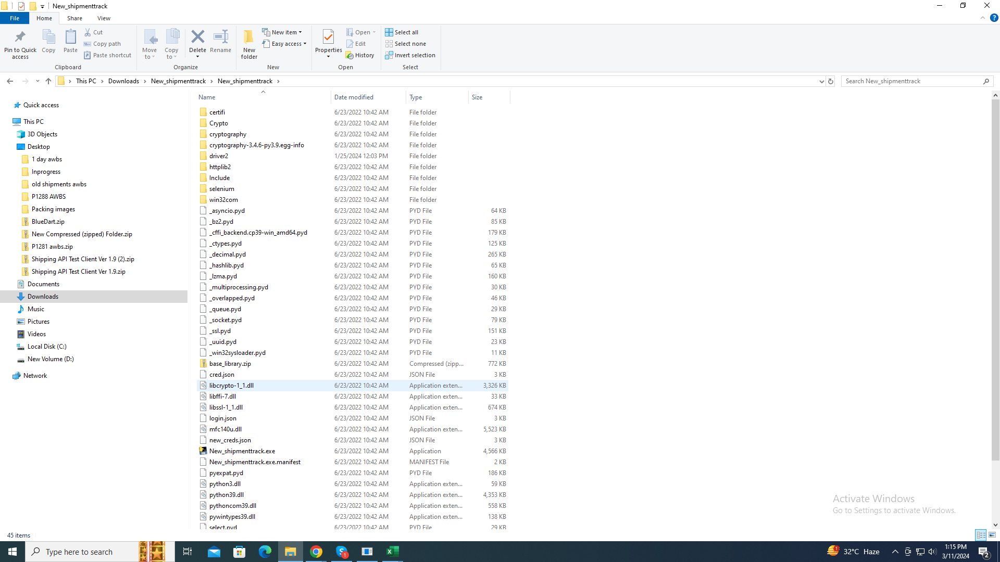

This is the CODE file there you can see New_shipmenttrack.exe. Click this file to run the program.
* **Step2:** Now, after the code runs it will ask you user Id and password to start the program.

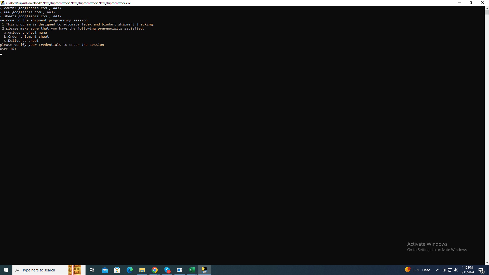

* **Step3:** After credentials verified, it will ask you file name of your google project and sheet name of your choice, here this is an important
> [!NOTE]
> This is completely case sensitive so we must enter the file name and sheet name as it is.

* **Step4:** Before uploading the project file there are some rules to follow. 
  - Rule1: we must provide Courier field as “bluedart”. 
  - Rule2: we must provide correct Tracking Id. 
  - Rule3: If both fields empty the code can’t read that row data. 
  - Rule4: If any of these fields is empty then the program stops there. 

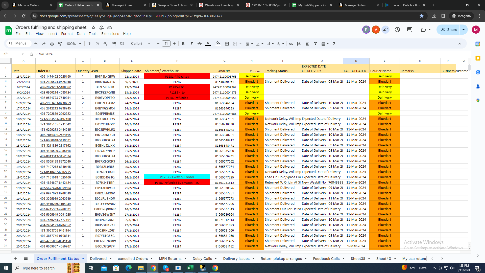

**Here you can see both fields got filled properly.**

* **Step5:** Now, after the code reads the file name and sheet name here, we must provide the starting index of your choice and ending index of your choice (your choice means from where you want to start and where you want to end by giving S NO. ex: 1-100 rows).
And we must enter the email id to whom you want to send notification after program completed.

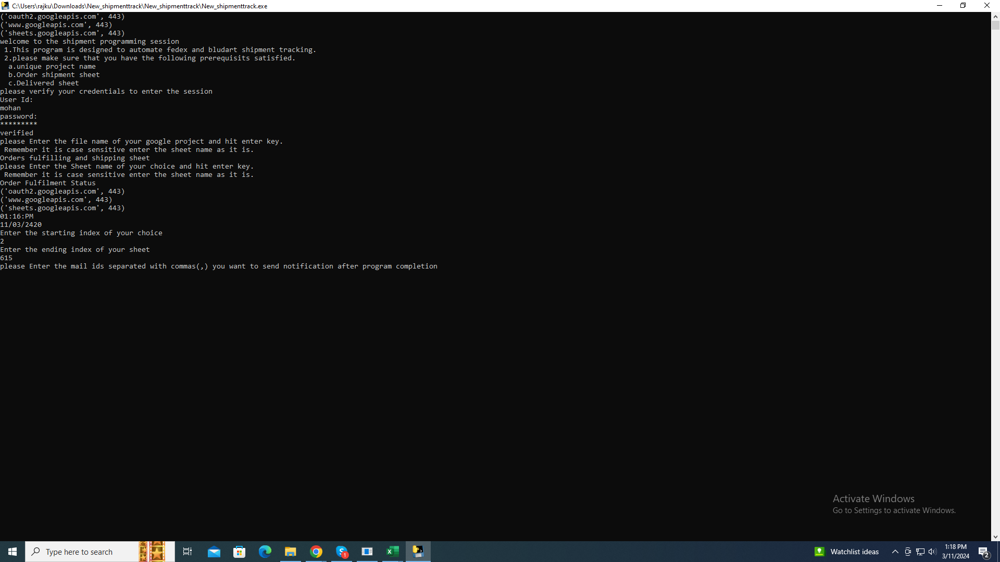

* **Step6:** After program completion it will send the delivered data into Delivered excel sheet and there you can see the proper organized delivered data.

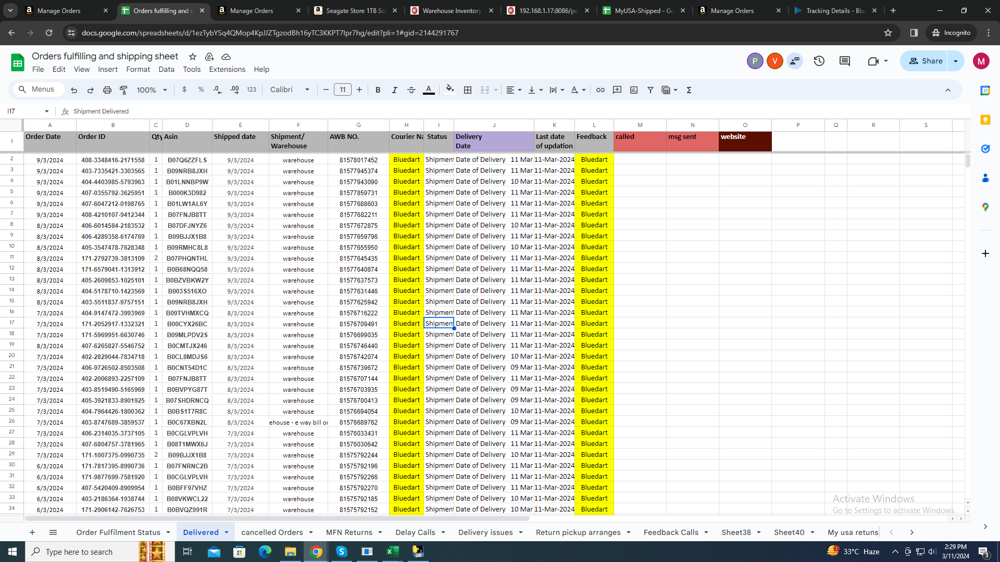

* **Step7:** And send the email message to email id which we provided before code starts.

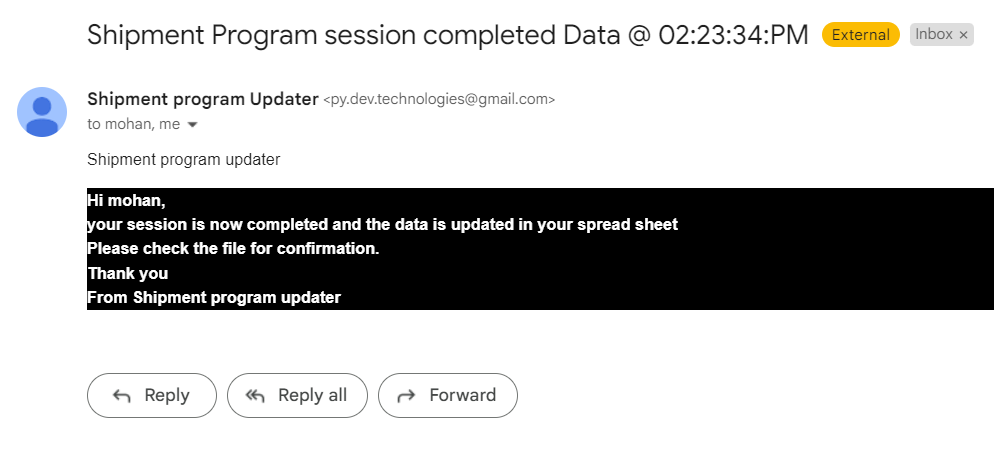

Here is the email message.

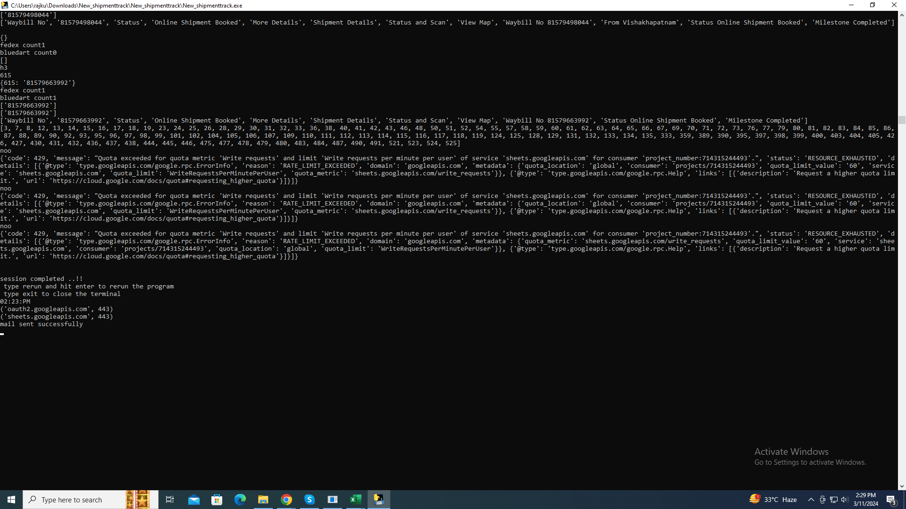

After code completion.

* **Step8:** If any product will not get the update even after the shipment date arrived then fulfilment team will mail to BLUEDART to raise the issue and get the reason updates.

### 4. Any updates required: 	

#
# USER GUIDE TO USE KEYWORD TOOL
### 1.	Why this tool:

* 	Before this tool the listing process becomes very tough and takes more time to do the work.

* 	So, to overcome this problem we use this KEYWORD tool and it reduced the time complexity and also the listing quantity increased.

### 2.	How it work : 

* 	This tool is used to get all the ASINS of particular product ( ex: IPHONE ).
* 	And after fetching all the ASINS  the listing work will becomes  simplified. 

### 3.	How to use it : 
 
* **Step1 :**   Open KEYWORD program and run the program
* **Step2 :**  Now after code runs we have to give USERNAME, PASSWORD, PRODUCT SEARCH TITLE
  
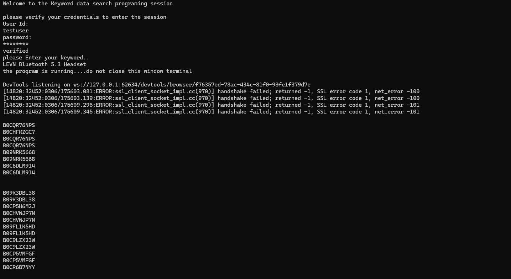
  
* **Step3 :**  And now the program provide all the ASINS in terminal that indicates completion  of the program.
  
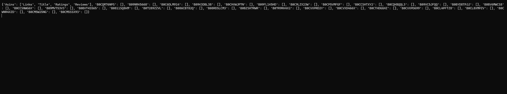  

* **Step4 :** Now this ASINS will display into EXCELL SHEET, where the sheet present in same code file and now by using this tools the listing process will become easy and simplified
  
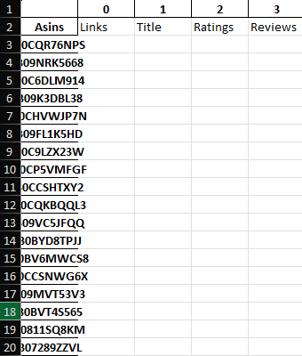

* **Step5 :** Now operation team manually check these ASINS in amazon seller central and if the product has  less number of sellers and high rating then they will add this particular ASIN to listing.
  
### 4.Any updates required
* By using this tool we are fetching only ASINS, but they requirement is to fetch the product TITLES  along with the ASINS.
  
# 

# USER GUIDE TO USE SIMPLE DOT COM TOOL
### 1.Why this Tool:  

This Simple Dot Com tool is used to upload the products in bulk, this tool makes operations department’s work easy by providing all the related fields which are required to upload the products in amazon seller central.
Before this tool, they used to enter data manually.

### 2.How it works:  

It takes bulk ASINS as input and provides all related data.

### 3.How to use it:  

* **Step-1:-** Open Simple Dot Com and paste the listing data ASINS which we want to bulk upload in amazon.in and click submit button.
  
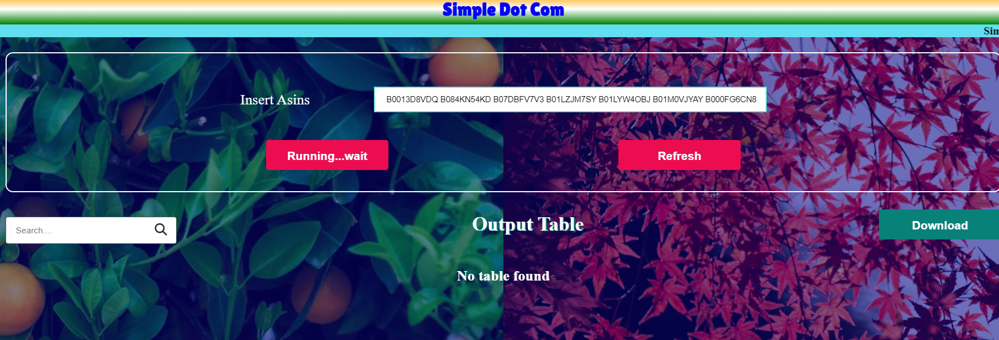  

* **Step-2:-** Simple Dot Com program  automatically produces the output excel sheet which contains ASINS and their related fields including PRICE converted to Indian currency that used to upload the data in Amazon seller central.
  
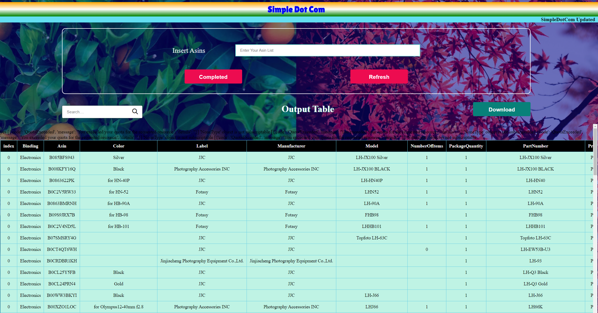  

* **Step-3:-** Now, download this sheet and Copy only required fields like ASIN , SKU , TITLE , BRAND NAME ,PRICE and WEIGHT data.
  
* **Step-4:-** And paste these 6 fields in Bulk formula sheet and the formula  will produce SALE PRICE and MRP which are also important to upload products using FLAT file.
  
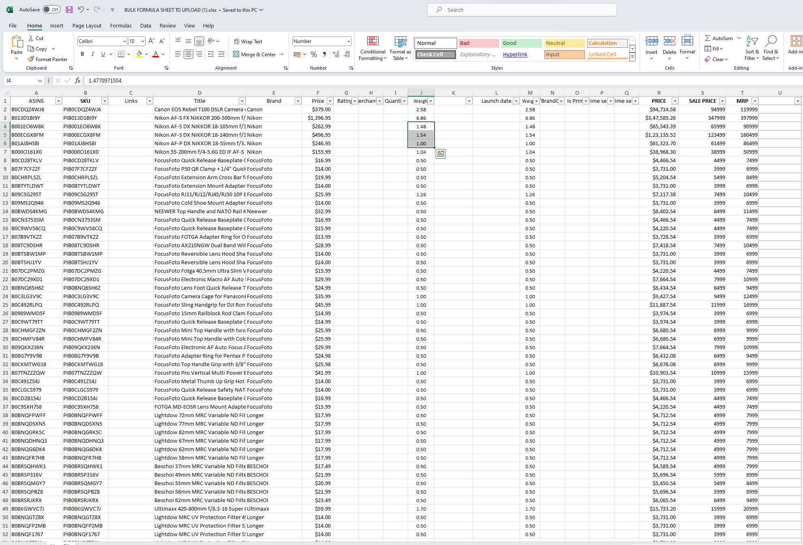  

* **Step-5:-** Open Amazon’s FLAT file provided by Amazon and Paste the data. And save the file with txt (tab delimiter) extension.
  
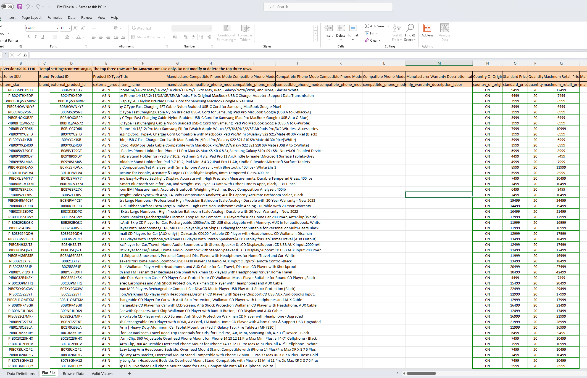  

* **Step-6:-** Now, Open amazon seller central and upload this FLAT file and click submit products.
  
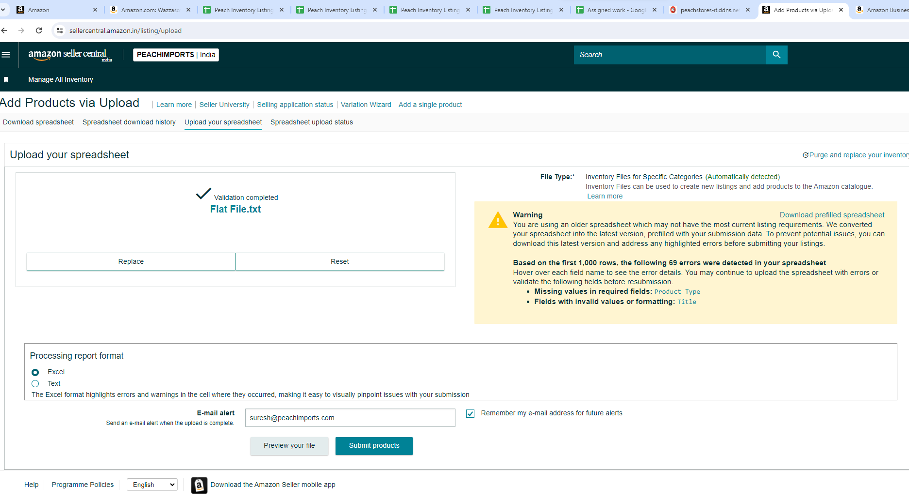  

* **Step-7:-** Then Amazon itself automatically uploads this bulk data in Amazon.in.
  
* **Step-8:-** Now, this data is visible to our amazon customers and shows seller as Peach imports.
  
### 4.Any Updates (If required): 

#

# USER GUIDE TO USE NEW INVENTORY LISTING

### 1.	Why this tool:
When operation team is done with their listing work we have to update the new list data, through that data we can check each members performance and can also update weight of the product, if the weight doesn’t match after stock delivered.
This tool is used for daily work updates for operation team.

### 2.	How it works: 
When we submit the bulk upload ASINS in this tool, it provides with some filed like (index, ASIN, date, restricted, name, weight, comment)
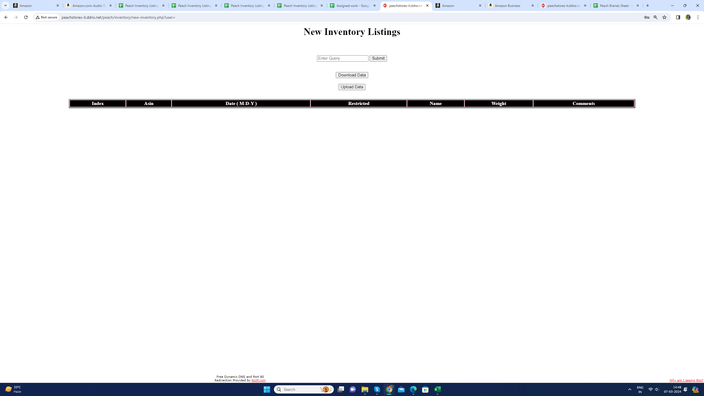 

### 3. How to use it:

*	**Step1:**  Upload the bulk upload ASINS in the query field.
*	**Step 2:** It provides all the details of that ASINS.
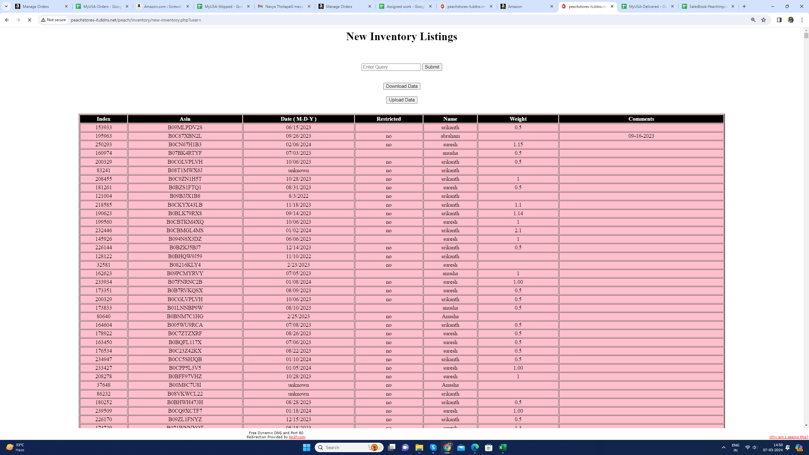  
* **Step3:** Now it shows the result table, there you can see some fields like 
Index, ASIN, date, restricted, name, weight, comment), now according to that fields we can check the product index, weight, ASIN, date of upload in the tool and also, we can check the person Name who was uploaded the data.
Setp4: And there is one more field called RESTRICTED here the operation team will directly mention “no".

> [!NOTE]
> Here if there is any product got restricted, then operation team will update restricted field to “YES”

* **Step 5:** We can also check each product result table data by uploading single ASIN of each product.
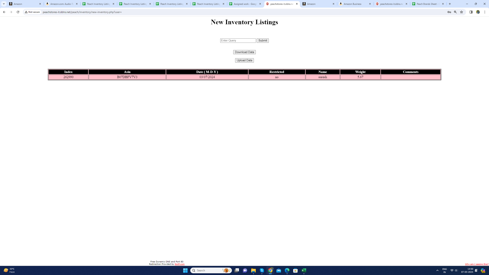  
* **Step 6:**  So, Now we can track the each person performance in operation team and also we can do update like (weight changing, updating restricted field).
### 3.	Any updates required: 	
#
# USER GUIDE TO USE AUTO PRICING CALCULATOR TOOL  
### 1.Why this tool:  

This **AUTO PRICING CALCULATOR** tool is used to update the product price automatically in amazon.in whenever there any change in price in amazon.com.
Before this tool they used to update the prices manually which will take days to complete the work. But this tool completes the work in minutes.  

### 2.How it works:  

This auto pricing calculator takes ASINS as input and produces the fields like SP, MRP, MIN price and MAX price. Which are used in auto pricing to achieve **BUY BOX**.  

### 3.How to use it:  

**Step-1:-** Open Auto pricing calculator contains tool and paste the ASINS in insert your queries field if you have more than one ASIN.  

  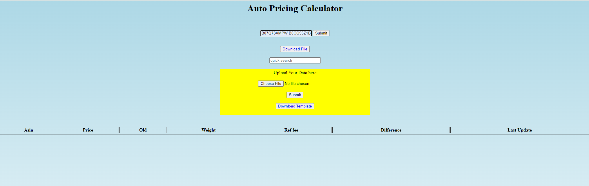  
  
**Step-2:-** Click submit button, this will generate the downloadable file link and download the file using the download file button.  

**Step-3:-** Now, open the downloaded excel sheet and it will display the updated pricing data.  

  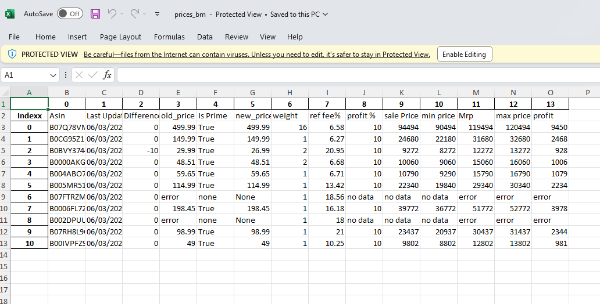  
  
**Step-4:-** Otherwise, use quick search field to enter single ASIN.  

**Step-5:-** This quick search will directly display the updated pricing data in the current page without any external file.  

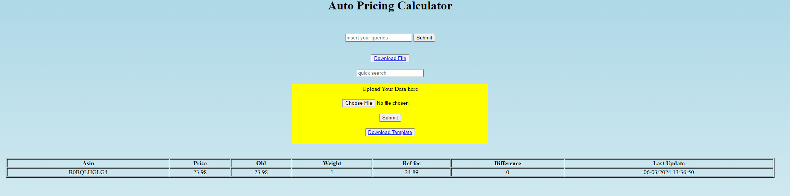  

### 4.Any Updates (If required):  

#

# USER GUIDE TO USE BUY BOX API 
### 1.AMAZON Buy Box eligibility factors:  

Sellers can’t just sign up and become eligible to appear on the Buy Box. Amazon considers a variety of factors before approval, although the first four factors listed below.
  *	Fulfilment method.
  * Landed price.
  * Shipping time.
  * Feedback rating.
  * Seller metrics.
    
are the most influential. 
### 2.Why this tool:  

Buy Box tool is used to help us to display our products in higher priority when customer search for some products in our listing and also shows our company name in seller and sold by.
Before this tool, they manually updated the prices to get Buy Box and It takes weeks to complete the work but now, the work became easy and time saving and now, they can do more work in less time.

### 3.How it works:  

The Buy Box API will take no. of ASINS and produces the table of products data. Now download the data using download button. Now open this downloaded file in Excell sheet and apply the filter to get only Buy Box FALSE data. So that we can update pricing rule to this FALSE data to achieve **BUY BOX**. 

### 4.How to use:  

* **Step-1:-**  Firstly, open Buy Box API and  paste the ASINS data in the input field and click submit button.
  
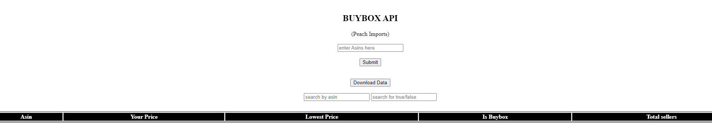  

* **Step-2:-**  It will produce the list of products , we need to download the file using download file button.
  
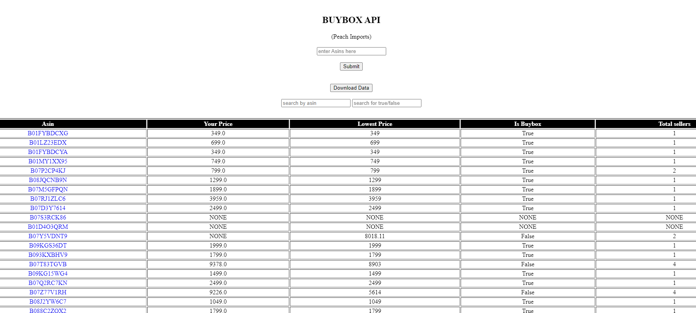  

* **STEP-3:-** Search for the Buy Box FALSE products in search field and copy the particular ASIN.
  
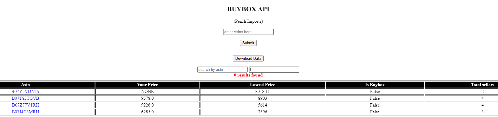  

* **Step-4:-**  Now , open Amazon Seller central and paste the ASIN and reduce the price , apply coupons , update handling time or Automate the pricing to achieve  Buy Box.

  
> [!NOTE]
>We should be careful while entering Min and Max prices otherwise it will return **FIXED PRICE ERROR**.

  
### 5.Any Updates (If required):  

1.	Some products are displaying FALSE in Is Buy Box field even though the products are already in Buy Box (TRUE).
#

# USER GUIDE TO USE PRODUCT IMAGE TOOL
### 1.	Why this tool:
*	For doing technical write up and catalogue.
*	We should provide the CUSTOMS SHEET to CUSTOMS DEPARTMENT.
*	So, in that sheet we must provide the shipment details like (IMAGE, TITLE, END USER, CATAGORIES).
*	In this sheet except IMAGE remaining, they will fill the data by manually.
*	So, by filling manually they take more time, and they can’t reach their targets.
*	To overcome all this issues PRODUCT IMAGE TOOL, play major role.

### 2.	How it works:
The main task of this tool is to provide the image URLs. 

### 3.	How to use it:
* **Step 1:** First operation team will get all the bulk shipment ASINS in on excel sheet.
* **Step2:** Now operation team will upload this ASINS in “asins_list” text file.
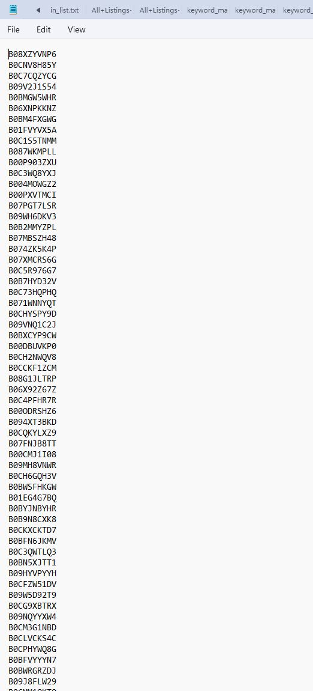

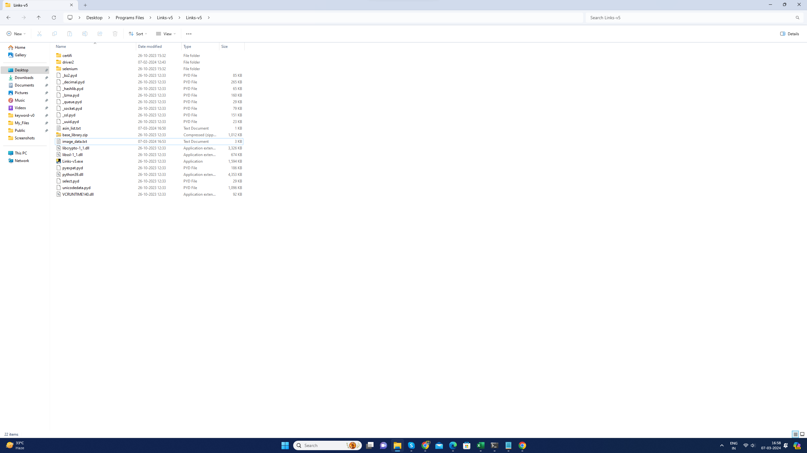  

**The above image represents the program file where you can find the .exe file which is use to run the program, and “asins_list” and “image_data” text file are also available in the same folder.**  

* **Step 3:** Now after running the program, it will provide all the image URLs automatically by checking the ASINS in “asins_list”.
  
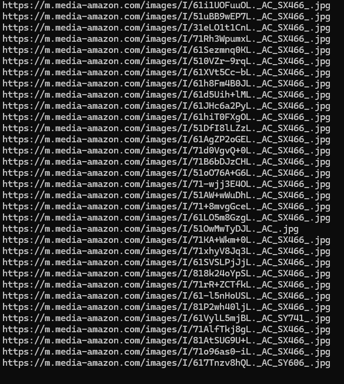  

**In the above image you can see the output of bulk ASINS.**

* **Step4:** Now after program completed all the URLs will be displayed in “image_data” text file.
  
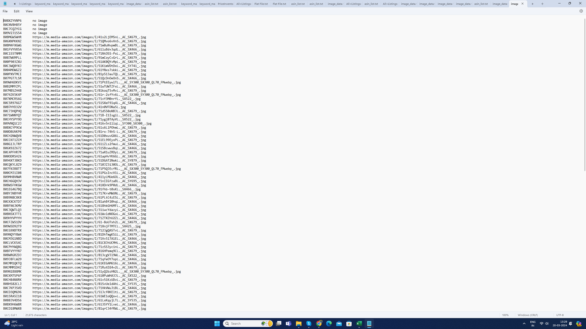  

**In the above image you can see the output of Shipment Product image links.**  

**Step 4:** And this “image_data” text file is used in IMAGE DOCX TOOL to convert the URLs to images.

### 4.	Any updates required:

#
# USER GUIDE TO USE IMAGE DOCX TOOL  

### 1.Why this tool:  
This tool is used to convert bulk image URLs to images and place these images in a Docx file which is catalogue file used for Customs verification.
Before this tool they used to insert each image manually in catalogue docx file which takes weeks to complete the work but now with the help of **PRODUCT IMAGE** and **IMAGE DOCX Tools**, the work became easy.

### 2.How it works:  
This IMAGE DOCX tool takes output of **Product Images** that is ASINs and their image URLs as input and produces images placed in catalogue form.
This tool takes bulk data and produces the results in catalogue form which is a format used for Customs verification.  

### 3.How to use it:  

* **Step-1:-** Copy the output of PRODUCT IMAGE tool that is ASINS and image URLs.
  
* **Step-2:-** Now, open IMAGE DOCX and paste the ASINS and image URLs in the input field.
  
  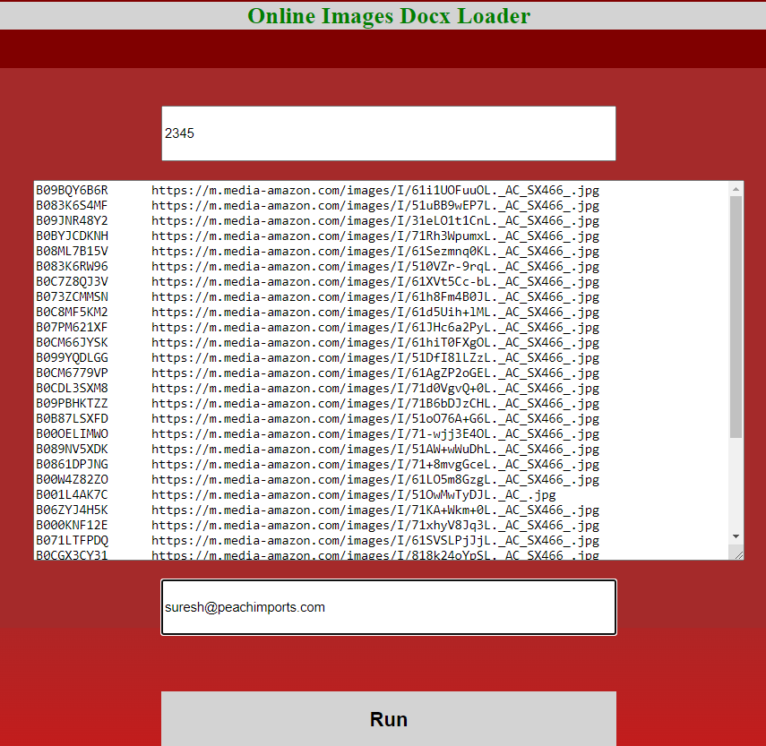  
  
* **Step-3:-** Click Run button and then Click download file button.
  
  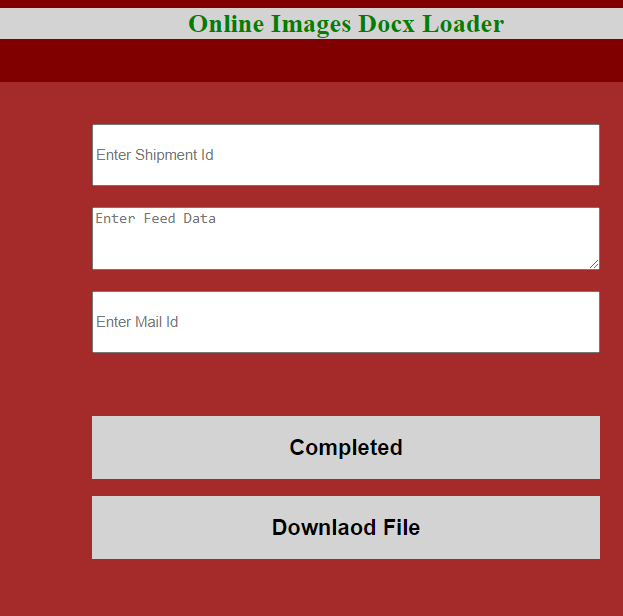
  
* **Step-4:-** Now, all the IMAGES and ASINS are placed in the catalogue form(Customs format) in Docx.
  
  
  
* **Step-5:-** Then, they have to fill the remaining fields like end user , category Etc and submit the form to the customs Department.

### 4.Any Updates (If required):  

#

# USER GUIDE TO USE BULK MERGING TOOL  
### Why this tool:  
This tool is used to merge the Invoice and Airway bill together for bulk products.
So that it is easy for fulfilment department to pack the product with Invoice and Airway bill without searching.
Before this tool, they used to search for the Invoice and Airway bill in the bulk data.  

### How it works:
This Bulk merging tool takes a folder of invoices and AWBs as input and produces a pdf file that contains product Invoice first and AWB next and other product’s invoice and AWB and so on in a sorted order.
So that it is easy for fulfilment department to get Invoice and Airway bill together for bulk products.

### How to use it:
* **Step-1:-** Open amazon seller central and select products that we receive the order. 
* **Step-2:-** Now, view the each product details and copy the tracking ID.
  
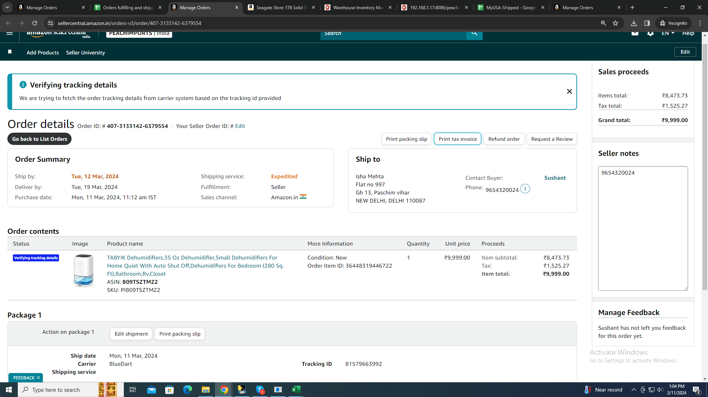

* **Step-3:-** Click on the print tax invoice button and save the invoice file name as ‘Tracking ID space – space I’ (Eg:81579366260 – I.pdf)    in pdf format. 
* **Step-4:-** Now, open BlueDart Air Way Bill(AWB) form  and fill the order details manually and save the form file name as tracking ID in pdf format.
  
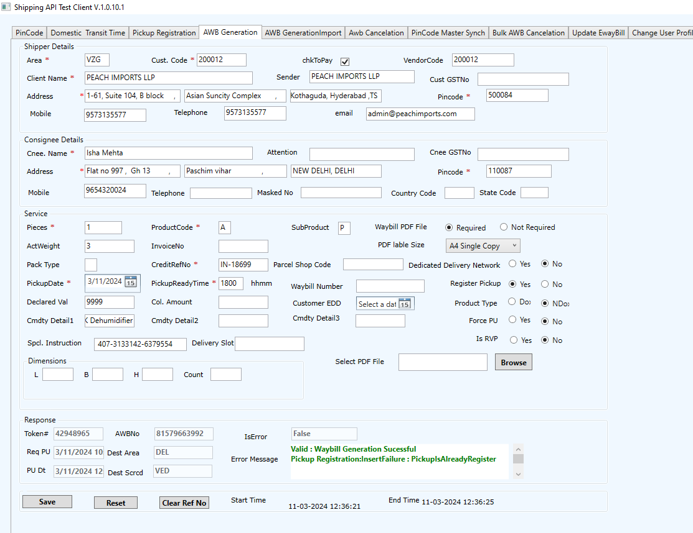

* **Step-5:-** Once, you get all the order’s INVOICE AND AWB in one folder.
  
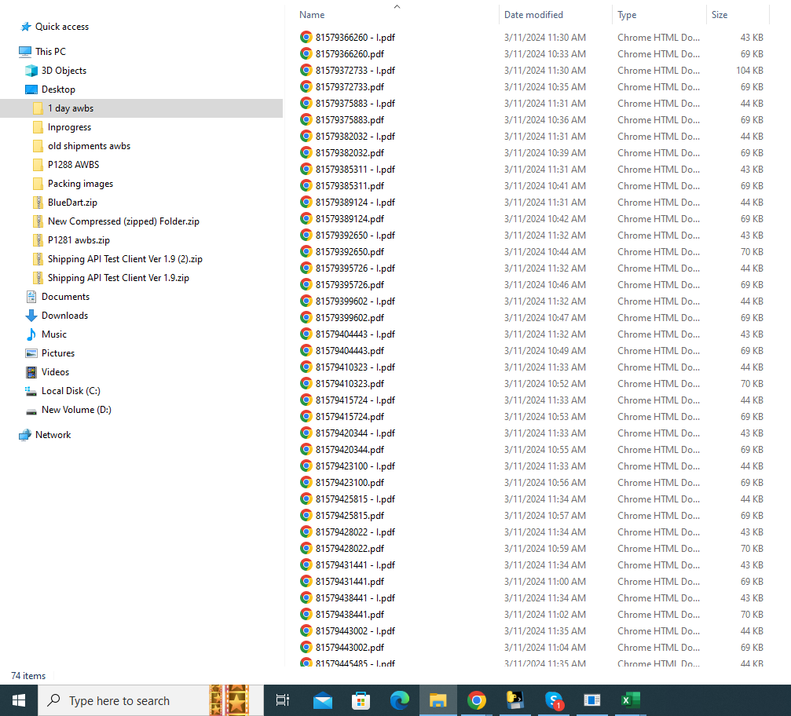

* **Step-6:-** Open Merge Your Bulk Files Into One Tool and enter your name and upload this Invoice and AWB folder in choose the file field and click upload button.
  
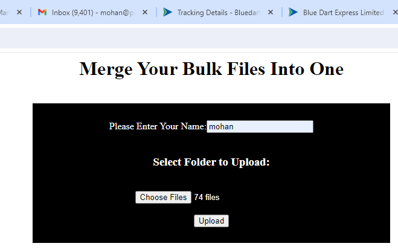

* **Step-7:-** After completion of this program, download the file using download report button.
  
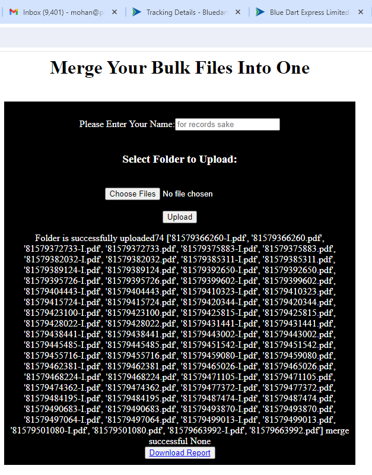

* **Step-8:-** Now, Extract this downloaded file and there is a pdf with invoices and AWBs for bulk orders.
* **Step-9:-** Send this Bulk PDF via Email to Warehouse Department. So that it is easy for them to pack the product with Invoice and AWB.

### Any Updates (If required):
#

# USER GUIDE TO READ PDFs IN BULK
### Why this tool:
This tool is used to get all the related data from Bulk Invoices and produces the output in TSV (Tab Separated Values) file.
This output data is used in BLUEDART to get Bulk AIRWAY BILLS automatically.
Before this tool, they used to fill the AWB forms manually but this tool is very helpful to FULFILMENT DEPARTMENT.

### How it works:
This tool takes bulk invoice pdfs as input and reads all the data in invoices.
Outputs the related attributes like Order Id, Invoice No, Name, Address, ASIN and Weight.

### How to use this tool:
* **Step-1:-** Open Read PDFs In Bulk tool, Enter your name  and Upload the file containing Bulk invoice pdfs.
  
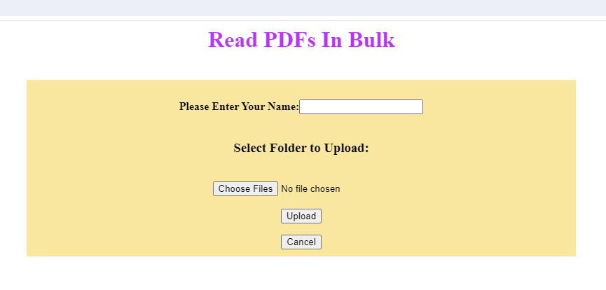

* **Step-2:-** Now, Click upload button and wait until the program completes.
* **Step-3:-** After completion of program, it will display a message like  “Folder is successfully uploaded  Output Result:  Data Extraction is successful”.

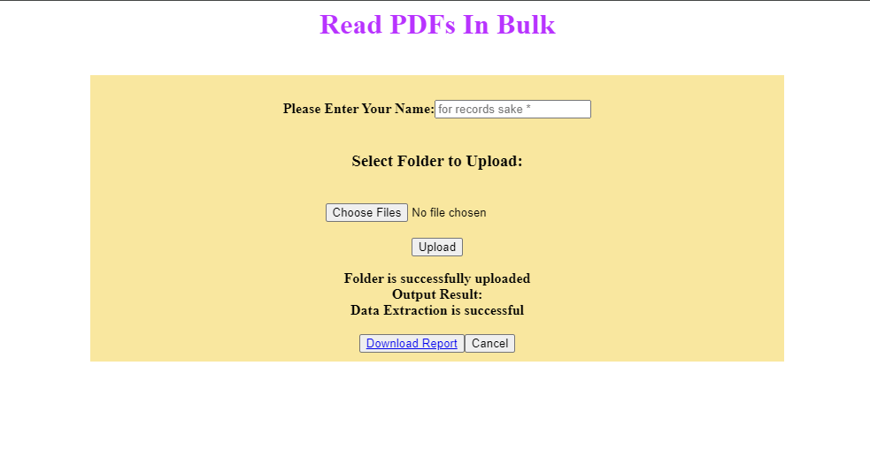
  
* **Step-4:-** Now, download the file using download report button.
* **Step-5:-** It will produces TSV data. Now, copy the data and paste in Excel as shown in the below image.
  
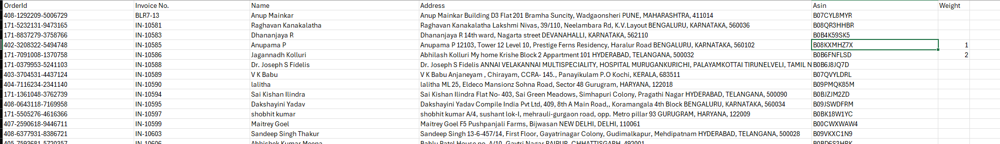

* **Step-6:-** This output data is used in BLUEDART Flat file to generate the AWB automatically.

### Any updates (if required):
* They also requested price attribute along with all the data.

#
# 
# USER GUIDE TO REFUND PROGRAM
## Refunds_checker&order_details 
### Why is this tool important?
The Refunds_checker&order_details tool is essential for efficiently managing and tracking refund information for bulk orders from Amazon. Previously, the refund status of each order had to be checked manually, 
which was time-consuming and prone to errors. This tool automates the process, ensuring accuracy and saving time by providing a streamlined way to gather refund details.

### How does the tool work?
The Refunds_checker&order_details tool is designed to integrate with Google Sheets and automate the process of checking the refund status of orders.  

**Here’s a step-by-step overview of how the tool operates:**  

1. Integration with Google Sheets:
   -	The tool is linked with a specific Google Sheet where order IDs are pasted in Column B.
     
2.	Launching the Tool:
      -  Open the Refunds_checker&order_details folder and launch the program.
      -  You will be prompted to enter your USER ID and Password.
      -  The tool verifies your credentials.

 
3.	Running the Tool:
      -  Once logged in, you will be asked to enter the Starting Index and Ending Index of the orders you want to check.
      -  Next, you will need to specify the Tab Name of your Google Sheet where you need to run the refund program.
      -  The tool will then ask if you wish to move rows of refunded items to a separate refund tab. You can respond with "true" or "false".
 
4.	Processing the Orders:
      -  If "true" is selected, the tool will move the rows of refunded items to the refund tab.
      -  Regardless of the choice, the tool will begin processing in the background.
      -  As the tool runs, it updates Column M of the specified Google Sheet with the refund amount. If an order is refunded, the amount will be shown; if not, it will display 0.
      -  Additionally, refunded orders will be highlighted in red for easy identification.

       
### How to use the tool?
Follow these steps to use the Refunds_checker&order_details tool:  

**Step 1.** Prepare the Google Sheet:
   -	Ensure that your order IDs are pasted in Column B of the Google Sheet.
     
   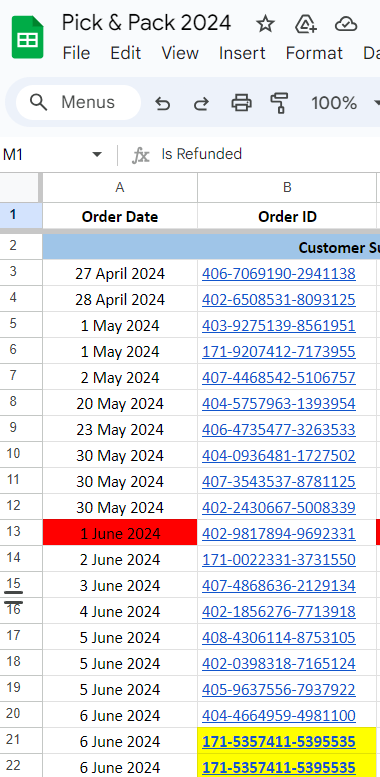

**Step 2.** Open the Tool:
   -	Navigate to the Refunds_checker&order_details folder.
   -	Open the program dashboard.
     
**Step 3.**	Enter Credentials:
   -	Input your USER ID and Password when prompted.
   - 	Wait for the tool to verify your credentials.
     
**Step 4.** Specify Index Range:
   -	Enter the Starting Index (the first-row number of the order IDs you want to check).
   -	Enter the Ending Index (the last row number of the order IDs you want to check).
     
**Step 5.**	Enter Tab Name:
   -	Provide the Tab Name of the Google Sheet where your order IDs are located.
     
**Step 6.**	Move Rows Option:
   -	When prompted, respond with "true" if you want refunded orders moved to a separate tab, or "false" if you want to keep them in the same tab.
     
   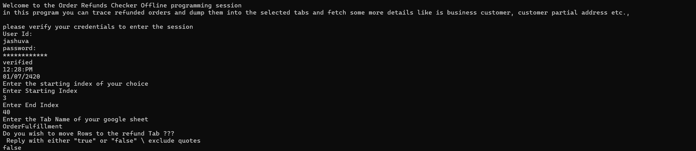
**Step 7.** Run the Tool:
   -	After providing all the required inputs, the tool will start running in the background.
   -	Monitor Column M of your Google Sheet for updates. Refunded amounts will be displayed, and refunded orders will be highlighted in red.
     
   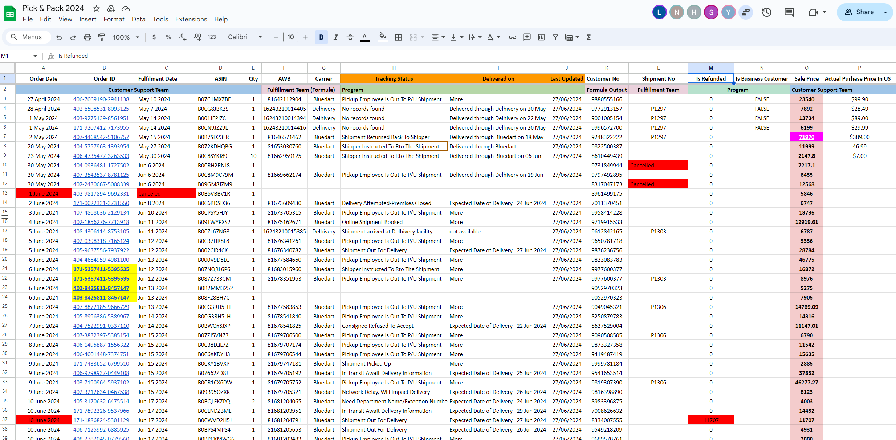  
   
    
   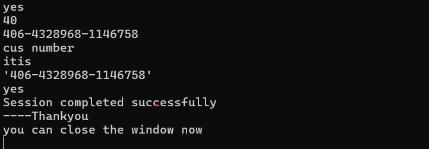

#

# User Guide To Use Live Orders Tracker Tool 

###  Why is this tool:
The Live Orders Tracker tool is essential for efficiently managing and tracking order details from Amazon Seller Central. Previously, gathering detailed information for each order required manual entry, which was time-consuming and prone to errors. This tool automates the process, ensuring accuracy and saving time by providing a streamlined way to gather order details in a Google Sheet.

### How does the tool work:
The Live Orders Tracker tool is designed to integrate with the Blumaple Customer Support Sheet and automate the process of capturing order details. Here’s a step-by-step overview of how the tool operates:
1.	Integration with Google Sheets:
   o	The tool is linked with the Blumaple Customer Support Sheet where the order details will be automatically added.
2.	Launching the Tool:
   o	Open the Live Orders Tracker folder and locate the program file.
   o	Click on the program file to start it.  
4.	Running the Tool:
   o	Once the program starts running, it will automatically begin adding order details to the Google Sheet.
   o	Each new order will be added to the first row of the sheet, pushing previous orders down.
  	
      The tool will provide comprehensive details for each order, including:  
            o	Shipment Id  
            o	Order Date  
            o	Order Id  
            o	Ship by  
            o	Deliver by  
            o	Phone  
            o	Address  
            o	ASIN  
            o	Quantity  
            o	Product Title  
            o	Price (Rupee)  
            o	Amazon Fee  
            o	Shipment No  
            o	Tracking Id  
            o	Tracking Status  
            o	Expected Date of Delivery  
            o	Is Business Customer  

### How to use the tool : 
Follow these steps to use the Live Orders Tracker tool:
   1.	Prepare the Google Sheet:
      o	Ensure that the Blumaple Customer Support Sheet is set up and ready to receive data.
   2.	Open the Tool:
      o	Navigate to the Live Orders Tracker folder.
      o	Open the program file to launch the tool.
     	   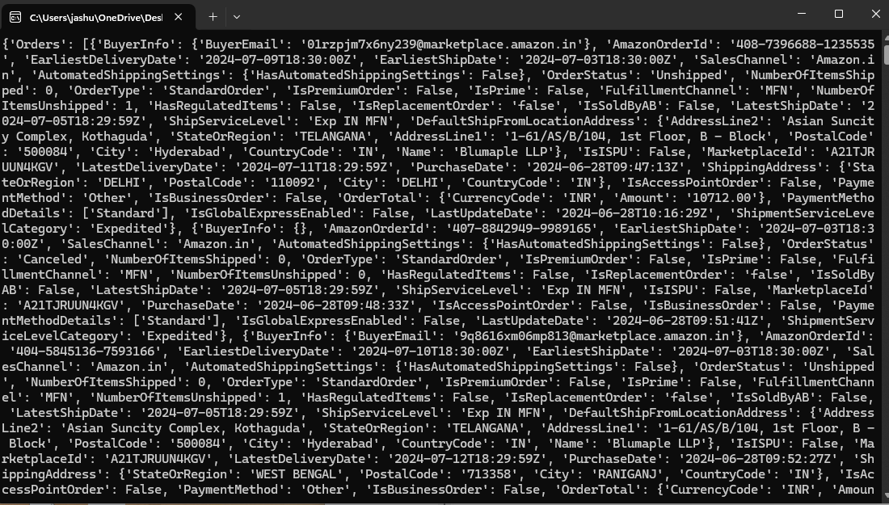
         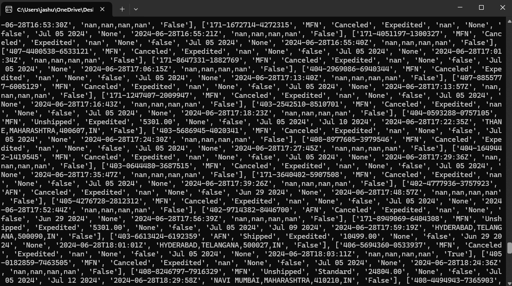
         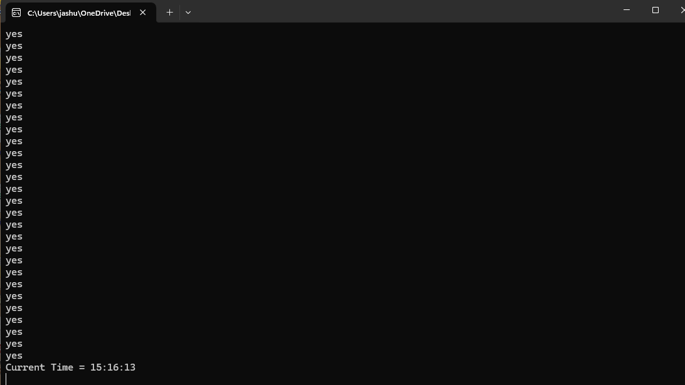
        	In the abouve image you can see "YES" if its business customer then it will display as "YES" or it displays as  "NO"
   4.	Monitor the Sheet:
      o	Once the tool is running, monitor the first row of the Google Sheet for new order details.
      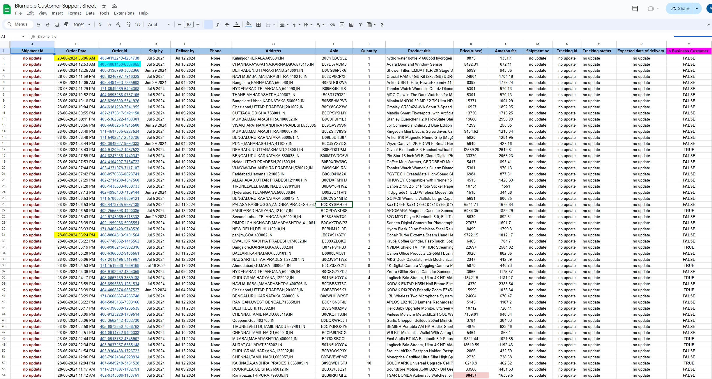
      o	The tool will update the sheet in real-time as new orders come in.
      o	Previous orders will be moved down the sheet to make room for the latest order details at the top.

### Any updates required:
   When we get a order which contain more than 1 prodcut for same customer then that particular data not adding to customer sheet.

# 

# NEW LAUNCHES AND BRAND WISE

###  Why this tool:

* To fetch the all data of Newly launched products and brand wise products.
* Operations department team need to do products listing like new launches and brand wise products.
* So, by searching the products manually they take more time, and they can’t reach their targets.
* To overcome all this issues NEW LAUNCHES AND BRAND WISE program, play major role.

### How it works:
The main task of this tool is to provide the ASINS, image URLs, Price, Ratings, Review count of both NEW LAUNCHES and BRAND WISE products. So, this program provides all the required fields.

### How to use it:
* **Step 1:** Based on the operations team requirements they should provide the product URL.
* **Step2:**  **NEW LAUNCHES** – Now open amazon.com and search the product you want.
* **Step3:**  Now click on the product and scroll to the **“product information”.**
* **Step4:** There you can see the **“BEST SELLER RANK”**, in that row u can see the link to which is named with the product you have searched.
  
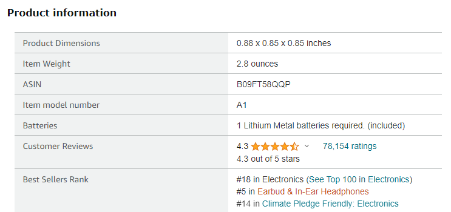  

* **Step5:** Now, click on it and the page will redirect to the new “NEW LAUNCHES” page.
* **Step 6:** Now, scroll down and you can find the new release link between the products click on it.
  
  

* **Step 7:** Now, the page got redirected to **“AMAZON HOT NEW RELEASES”**
* **Step 8:** Now, copy that page URL.
  
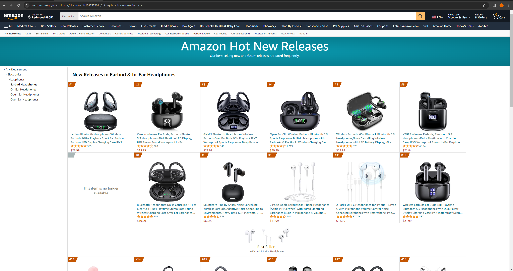  

* **Step 9:** Now, run the program and enter your login credentials carefully.
* **Step 10:** Ater credentials verified there you can see the options to select as shown in below image.
* **Step 11:**
   - If you want to run **NEW LAUNCHES** provide input 1 and click enter.
   - If you want to run **BRAND WISE** provide input 2 and click enter.

* **Step 12:** As we are discussing about NEW LAUNCHES select option 1 and click enter and provide the previously coped URL and click enter.
* **Step 13:** Now, program will run and fetch the data, once program completed you can see “Program successfully completed…” in the terminal.
* **Step 14:** Now open the **“newlist”** excel sheet to check the output result.
* **Step 15:**  **BRAND WISE**  – Now open amazon.com and search the product you want.
* **Step 16:** Now left side of the page you can see the filters there you just select the bran you want in brand section and copy the page URL.
  
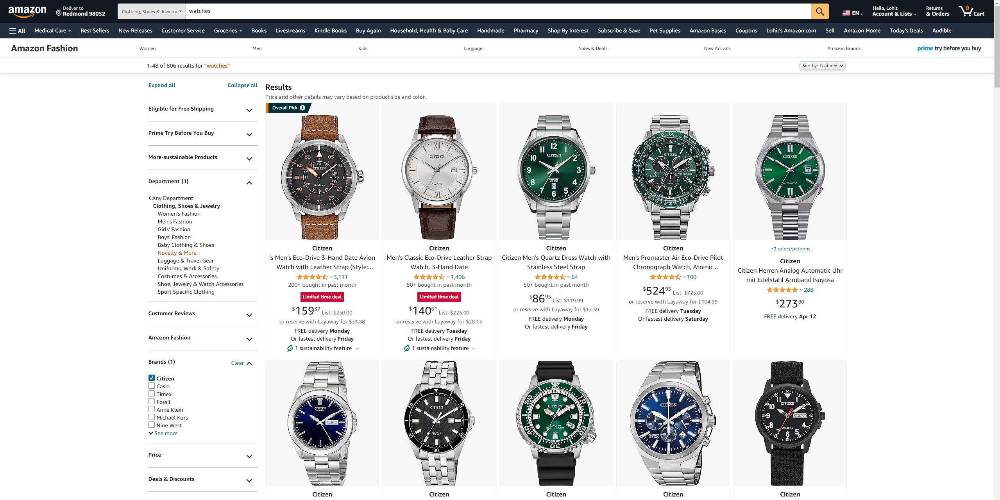  

* **Step 17:** Now, run the program and fill your login credentials carefully.
* **Step 18:** Ater credentials verified select the option 2 and click enter and provide the previously coped URL and click enter.
* **Step 19:** Now, program will run and fetch the data, once program completed you can see **“Program successfully completed…”** in the terminal.
* **Step 20:** Now open the “brandlist” excel sheet to check the output result.

### Any updates required:

# 

# SHIPMENT VERIFICATION TOOL  

### 1.Why this tool:  
This tool is used to verify the shipment products. Whenever we receive the shipment, we need to verify the products using shipment Verification tool.
### 2.How it works:

  
### 3.How to use it:  

* **Step-1:-** When we receive the shipment, Open the shipment verification tool.
* **Step-2:-** Enter the details like shipment id,
* **Step-3:-** Now, take any product from the shipment and check for that particular product name in the shipment verification list.
* **Step-4:-** If you find the product in the shipment list then bubble the product in verification filed. And If you find the same product in the shipment list then bubble the product again.
    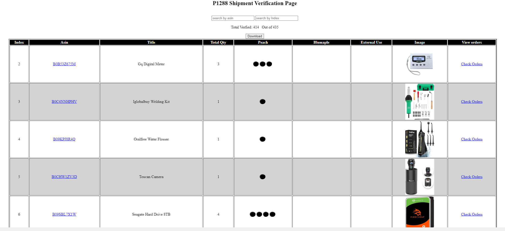

* **Step-5:-** Which means, the number of bubbles in each product indicates the quantity of particular product.
* **Step-6:-** After finishing shipment products verification. Click on orders filed and if any orders are there for that particular product, then print the invoice and airway bill and pack the product.
* **Step-7:-** Otherwise, place the product in PRO ACTIVE.

### 4.Any Updates (If required):  
1. They requested to print the missing products after comparing  bubbling (Verification) numbers and quantity.
#  

# USER GUID TO WAREHOUSE INVENTORY MANAGEMENT (WIM)

**MENU:**
### 1.	DASHBOARD

### 2.	RETURNS
   * 	MANAGE RETURNS
   *	RETURN FREQUENCY
### 3.	REPORTS
   *	STOCK REPORTS
   *	SHIP WISE REPORTS
   *	DATE WISE REPORTS
   *	DATE REPORT (NEW)
### 4.	HISTORY
   *	VIEW HISTORY
   *	VIEW FILES
### 5.	ORDERS
   *	BULK CONFIRM
### 6.	SHIPMENTS
   *	VIEW DASHBOARD
   *	VIEW BACKEND
### 7.	UPLOADS
   *	MANUAL (SINGLE)
   *	NEW DATA (BULK)
   *	EDIT OLD (BULK)
### 8.	BARCODES
   *	GENERATE BARCODES
### 9.	TOOLS
   *	VIEW DASHBOARD
   *	ONLINE IMAGE DOCX
### 10.	 ADMIN USER

### 11.	 DEVELOPER  

# 1.DASHBOARD:
### WHY THIS TEMPLATE:
This template is helpful for **FULFILMENT DEPARTMENT**. They will upload the bulk file here itself, later in dashboard you can see all the shipment details.
### HOW IT WORKS:
1. In dashboard we can see Bulk Upload and Single Upload buttons, upcoming shipment data, and we can also download the Available stock data, Unavailable Stock data, Complete data.
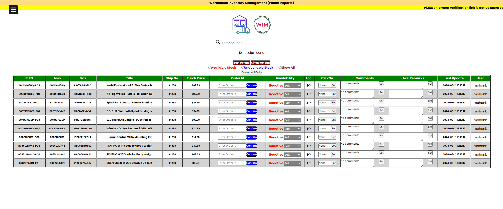
3. Available stock means the stock which is available in our warehouse.
4. Unavailable stock means the stock which is not available in our warehouse.
5. In search bar we can search any ASIN details and below we can see the total result.
6. In some cases the fulfilment team will manually update the “Availability” field.
7. Bulk upload is used upload the bulk data to project all the data on dashboard.

### HOW TO USE BULK UPLOAD:
* **Step1:** Open Warehouse dashboard there you can see the bulk upload button.
* **Step2:** Now click the bulk upload button, then you can see the interface of it as shown in below image.
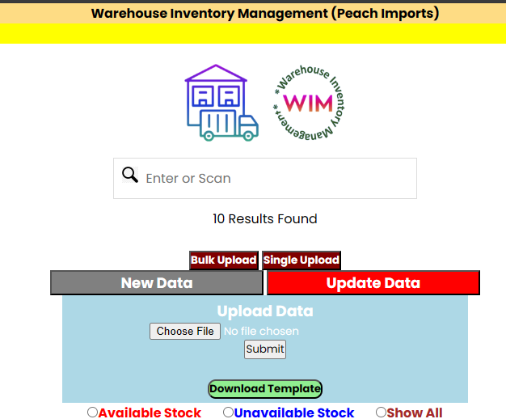
* **Step3:** Click of\n Download Template, here the excel sheet will download.
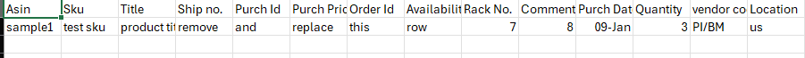
* **Step4:** Fill the data according to the shipment sheet.
* **Step5:** Upload this downloaded file in chose file and click submit.
* **Step6:** There is one more option **Update Data** this is used to update any fields except ASIN. 
* **Step7:** To update this first click on download template in Update Data.
* **Step9:** Now the excel sheet will downloads, here based on product PUID we must do update.
* **Step10:** Now upload the updated file by clicking on choose file and click submit.
#
# 2.RETURNS:
In returns we have 2 options one is **MANAGE RETURNS** and another one is **RETURN FREQUENCY.**  

## MANAGE RETURNS:  
### WHY THIS TEMPLATE:
This template is helpful for **FULFILMENT DEPARTMENT**. They used to manage the returns and update the product status based on the conditions.

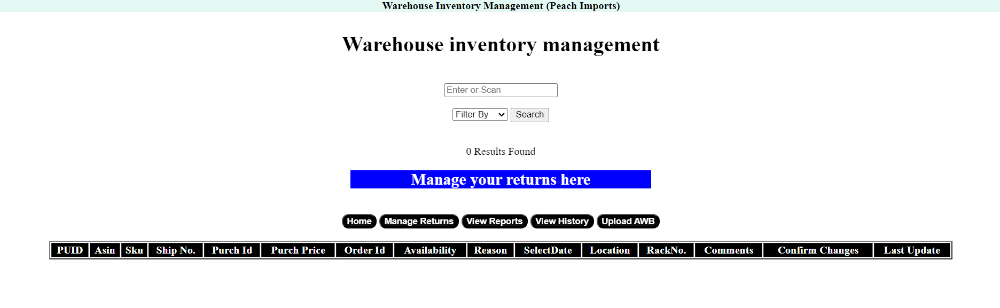

The above image is for **MANGE RETURNS.**

### HOW IT WORKS:

1.	The fulfilment team will deal with this returns template, after getting the returns they provide product id or order id or ASIN or PUID in input filed.
2.	Now they get the total information on that product, based on the return product condition they will update the “Availability field”. 
3.	If it’s good, then they will update it as RESTOCK if product is fake then they will update it as fake and if the product got used and it looks with multiple scratches then they update it as “Add to bin”.
4.	This is about MANAGE RETURNS.
   
### HOW TO USE:  

* **Step1:** Open Warehouse and click on side menu, move to returns and click on it, there you can see 2 sub-options one is MANAGE RETURNS another one is RETURN FREQUENCY.
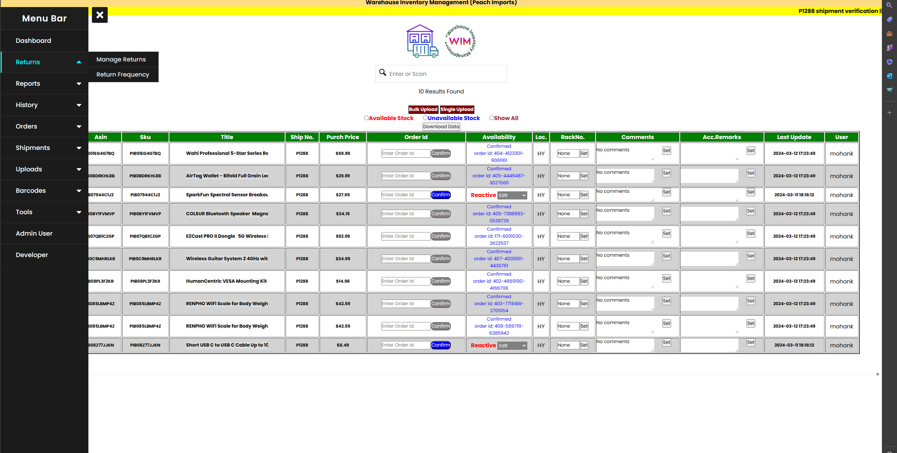
* **Step2:** Click on MANAGE RETURNS and there you can see the input filed, in that field provide order id it will show the complete information of that returned product.
* **Step3:** Now fulfilment team will check the product physically and base on the product condition they will update the “Availability field”
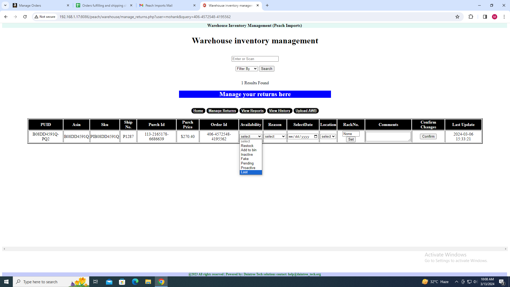
 
## RETURN FREQUENCY:  

### WHY THIS TEMPLATE:  

This template is helpful for **FULFILMENT DEPARTMENT**. They used to check the product return count and if the count got repeated multiple times, then it will directly move to BIN.  
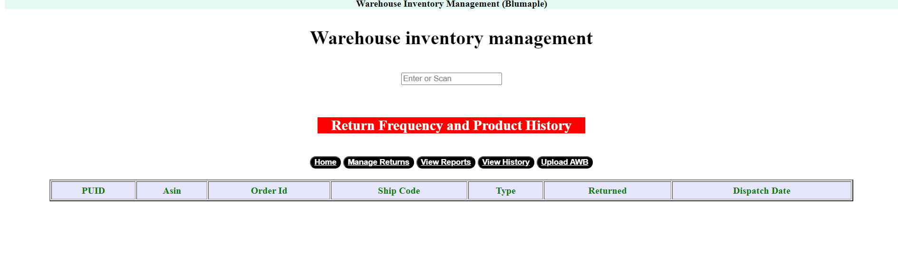
The above image is for **RETURN FREQUENCY.**  

### HOW IT WORKS:
1.	This template is used to check the count of product return.
2.	The fulfilment team will deal with this return’s frequency template. They provide product id or order id or ASIN or PUID in input filed.
3.	To check the count of product got returned. 
4.	If the product got returned multiple times, then it will move to “bin”.

### HOW TO USE:
* **Step1:** Open Warehouse and click on side menu, move to returns and click on it, there you can see 2 sub-options one is MANAGE RETURNS another one is RETURN FREQUENCY.
* **Step2:** Click on RETURN FREQUENCY and there you can see the input filed in that field provide order id it will show the complete information of that returned product.
* **Step3:** Now the operation team will check the product and when it crosses the return count then it will move to “BIN”. The return count should be 0, but if the product gets return more than 2 times then they will consider that product is unsellable product. 
#

# 3.REPORTS
Reports field is used to maintain the stock reports. This Reports field will show all the products in monthly wise reports, Stock reports, shipment wise reports.  
### WHY THIS TOOL:  
The Reports field is helpful for **WAREHOUSE** Department to maintain and manage the WAREHOUSE Stock. By using this tool, they will  update the stock details like PROACTIVE and REACTIVE to Manager.
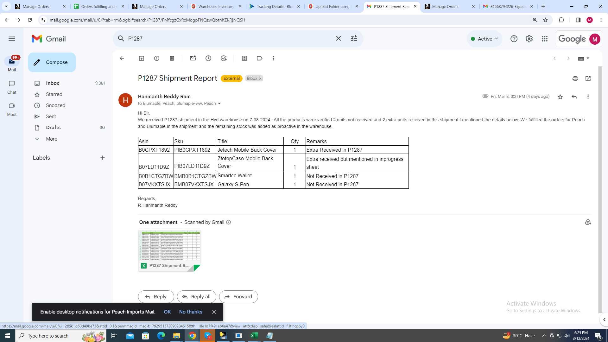  

### HOW TO USE THIS TOOL:  
  
## STOCK REPORTS:
* **Step-1:-** Open WIM and click on Reports field in menu and select Stock Reports.

 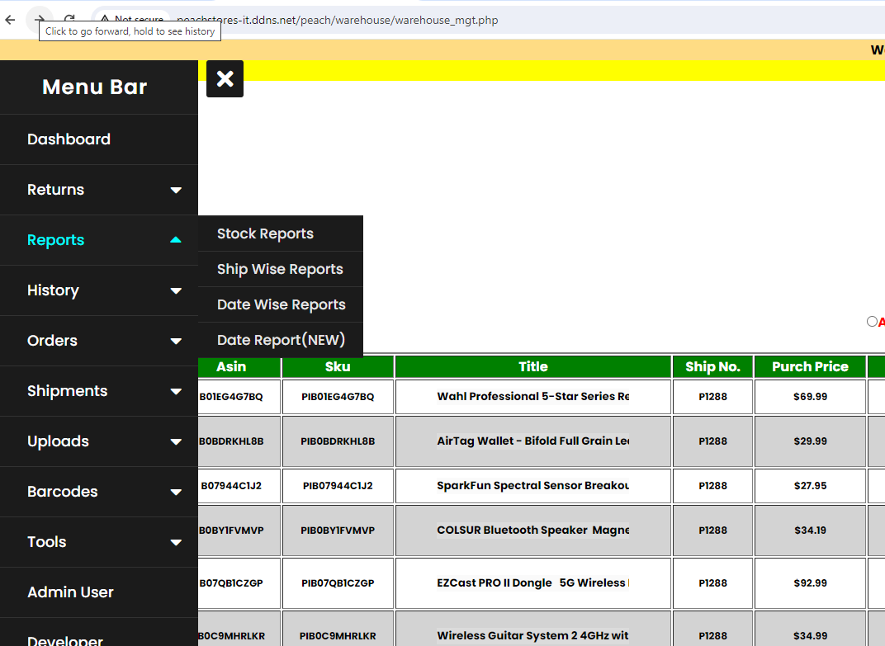  

* **Step-2:-** Show all button will produces all the data about the products which are in our WAREHOUSE (PROACTIVE).

  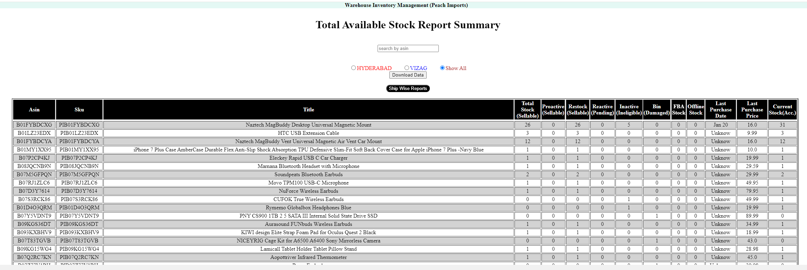
  
* **Step-3:-** Vizag button will produces products data which are in Vizag and Hyderabad button will produces products data which are in Hyderabad.

* **Step-4:-** We can download this data using download data button.

## SHIP WISE REPORTS:
* **Step-1:-** Select the Ship code then it will produces the Shipment Wise Records.

* **Step-2:-** The Dynamic Stock table represents the overall stock that is PROACTIVE and REACTIVE in that particular Shipment.
  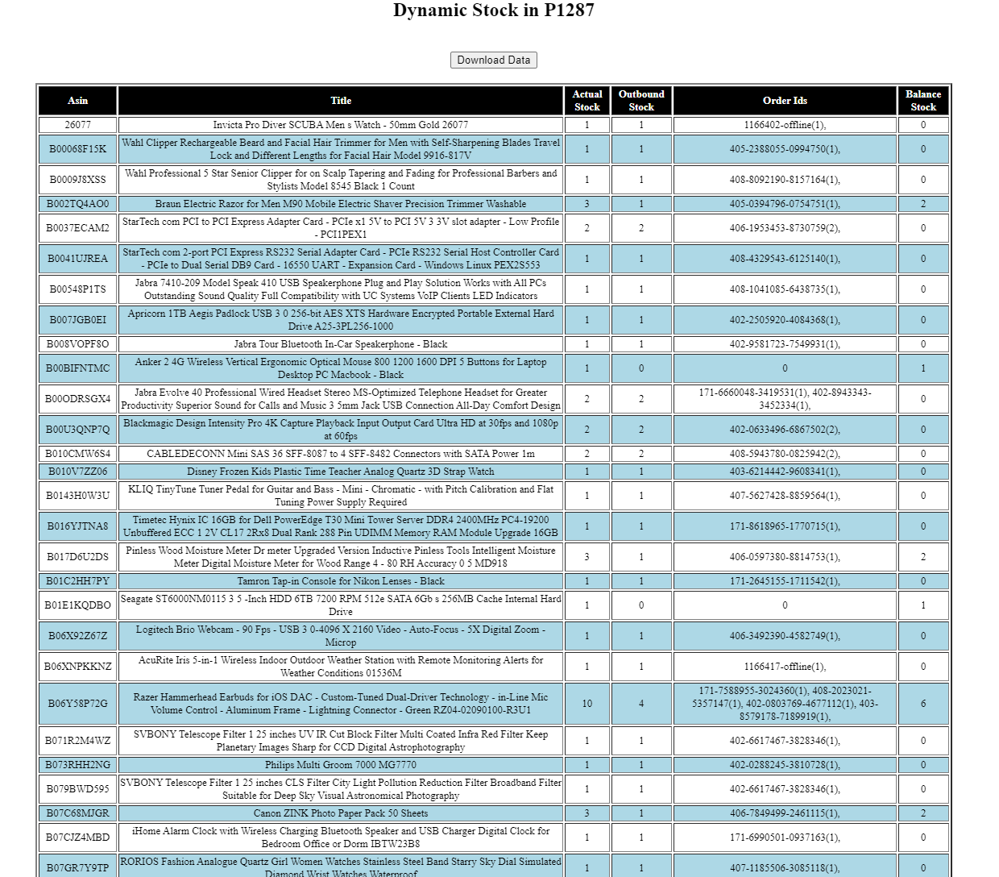

* **Step-3:-** The Unused Stock table represents the PROACTIVE Stock that is the left over stock after outbound in that particular Shipment.
  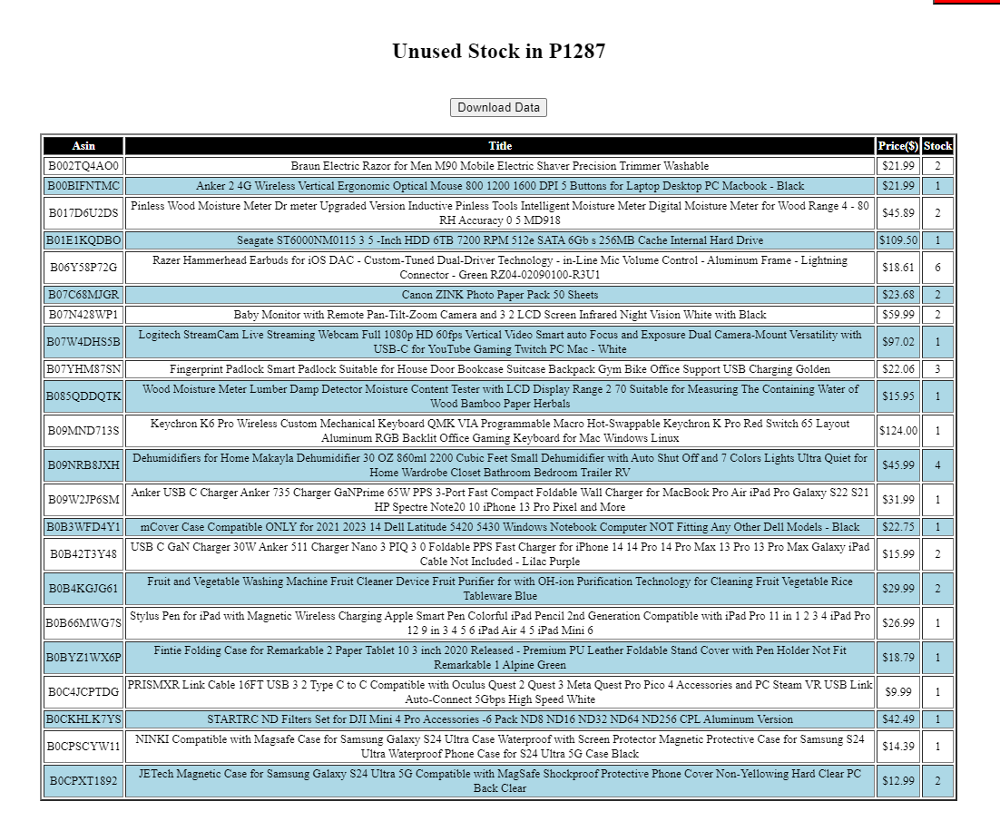

* **Step-4:-** The middle table represents all the shipment data with PUIDs. The PUIDs are used to distinguish the products with Same ASIN, So that it is easy for FULFILMENT Department to know which product got returned.
  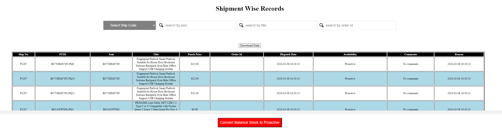

* **Step-5:-** The Shipment products are REACTIVE by Default and They use convert the balance stock to Proactive button to Convert the remaining products after outbound to Proactive.

## DATE WISE REPORTS:  

* **Step-1:-** Enter the start date and the end date and click submit button.

* **Step-2:-** It will produces the date wise reports.
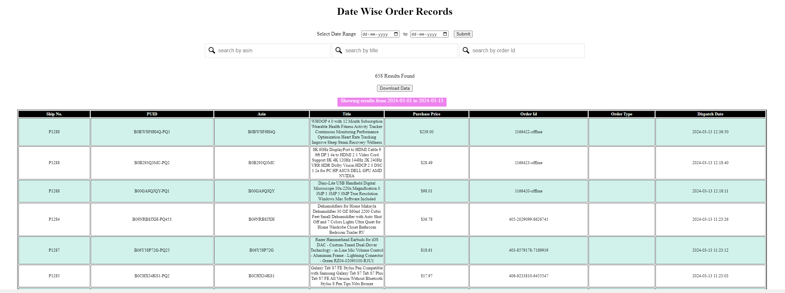

## DATE REPORTS: 
* **Step-1:-** Enter the start date and the end date and click submit button.
#
# 4.HISTORY  
History is used to know what the updates or actions are done in the WIM at what time and how has done that action.  

### WHY THIS TOOL:  
This tool is helpful for FULFILMENT Department to know daily updates and history.  

### HOW TO USE THIS TOOL:  
* **Step-1:-** Open WIM click on History in Menu and it will produces all the log data.
  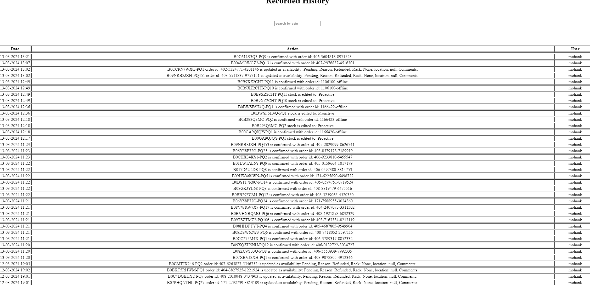

* **Step-2:-**
#
# 5.ORDERS:  

## Bulk Confirm   

### WHY THIS TEMPLATE:
This template is helpful for **FULFILMENT DEPARTMENT**. They used this template to upload the order list data to confirm the orders in BULK.

### HOW IT WORKS:
1.	In this Bulk Confirm template, after order verification they will download the template and after downloading it shows an excel sheet.
2.	 In that they will fill the data from order confirm sheet into new downloaded sheet in the fields of ASIN, Order id, Quantity, Shipment number, Order type.
3.	 And they save that file and that file they will upload into bulk confirmation template, now in backend code will automatically confirm the orders where it changes the status Reactive into order confirmed with order id.
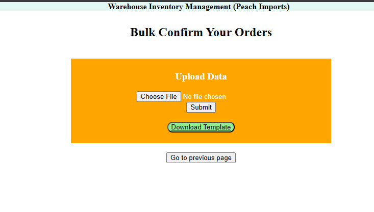

This is the bulk confirmation template.  

5.	Before using this template, the operation team will do the confirmation in manually then it took lot of time to confirm the orders, because the order count will be more than 200.
6.	So, after introducing this bulk confirmation template, it will automatically do the order confirmation. 
7.	Before order confirmation, the template will cross check the order confirmation sheet if all the criteria will satisfy then only the orders will be confirmed. 
8.	CRITERIA: All the ASINS, product title, and order verification sheet and shipment sheet should merge.
9.	If in cases the ordered ASIN and offer ASIN will miss match, then fulfilment team will update it manually in dashboard.  

### HOW TO USE:
* **Step1:** Open Warehouse and click on side menu, move to Orders, and click on it, there you can see an option: Bulk Confirm.
* **Step2:** Click on the Bulk Confirm and you can see the bulk confirmation templates as shown in above image.
* **Step3:** Now click on download template, it downloads one excel sheet.
  
* 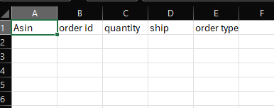
  
* **Step4:** Here you can see the required fields in above image, now fill that fields where the data available in order verification sheet and save the file.
* **Step5:** Now open template and click on choose file and upload the saved file.
* **Step6:** Now the code runs and confirm the orders in bulk. 
#

# 6.SHIPMENTS:
## 	View Dashboard  
### WHY THIS TEMPLATE:
This template is helpful for **WAREHOUSE DEPARTMENT.** They use this template to confirm and check the products by comparing the received products and ordered products.  

### HOW IT WORKS:
1.	In this Shipments there are 2 options one is **“View Dashboard”**, and another one is **“View Backend”**. 
2.	Here in this **“View Dashboard”** when there is new shipment then they will request for new link.
   
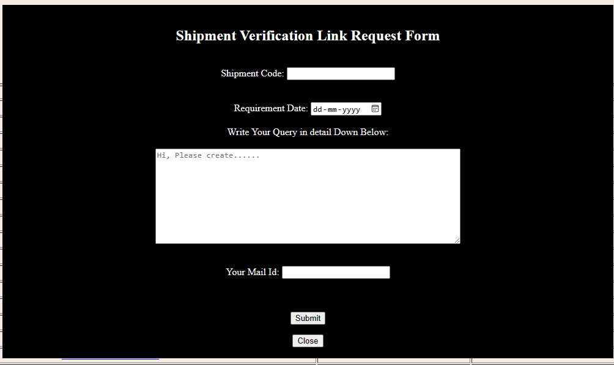

This is the request new link template image.  

3.	After once the link is generated, through the link the warehouse department will check all the delivered products.
4.	If received product matches to ordered product then they will do Inbound.
5.	And if the order available then they will Outbound that product
6.	Before outbound they should download the air waybill and invoice bill without those bills, they can’t outbound the product.
7.	To download those both air way and invoice bill first **OPERATIONS TEAM** will upload the merged air way and invoice bill pdf file in backend template.
8.	After completing the outbound process, the product delivers to customer.

### HOW TO USE:
* **Step1:** Open Warehouse and click on side menu, move to Shipments, and click on it, there you can see two options one is View Dashboard; another one is View Backend.
  
* **Step2:** Click on **“View Dashboard”** now you see the shipment verification dashboard.
  
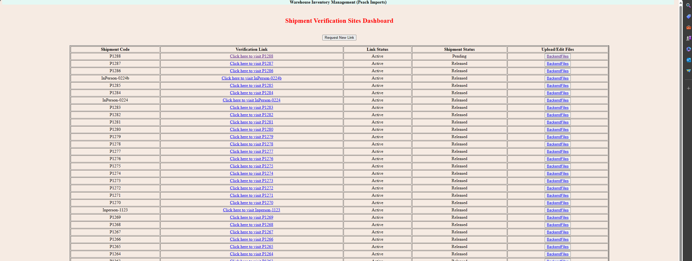  

* **Step3:** Click on **“Request New Link”** it shows you **“Shipment Verification Link Request form”** template.
  
  

* **Step4:** Fill the input fields and click on submit.
  
* **Step5:** Now the new link will generate with the shipment id.
  
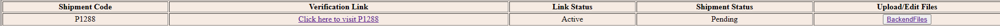  

* **Step6:** After clicking on new link, alert box will appear and ask your name to identify who is operating that template. So, enter your name.
  
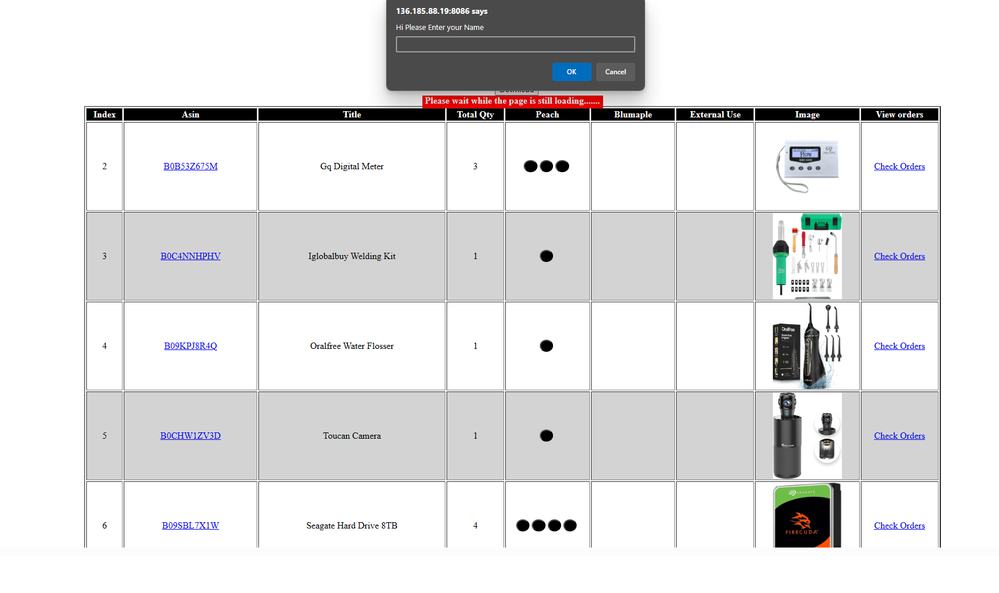  

* **Step7:** Now check the product with ASIN or TITLE, if details match bubble it, then it turns into black colour that means the product was matched and verified.  
* **Step8:** Now click on “check Orders” if there are no orders to both PEACH and BLUMAPLE then empty table will appears as shown in below image.
  
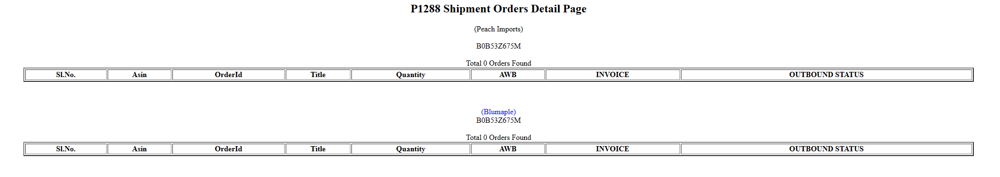  

* **Step9:** Now click the next product “check order” button if the order is there for PEACH, then table data shows to peach if it’s there for BLUMAPLE then according to that it shows the table data as shown in below image.
  
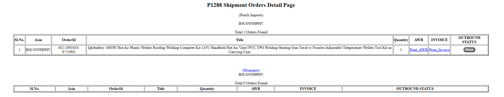  

 Here you can see the order is there for PEACH and BLUMAPLE is empty.  
  
* **Step10:** Now click on “print AWB” and “print invoice”, it shows you the airway and invoice bill’s if the operation team uploads the merged file in backend. 
* **Step11:** After clicking on “print AWB” and “print invoice”, if the bills consist of then you can see the bills as shown in the below images.
  
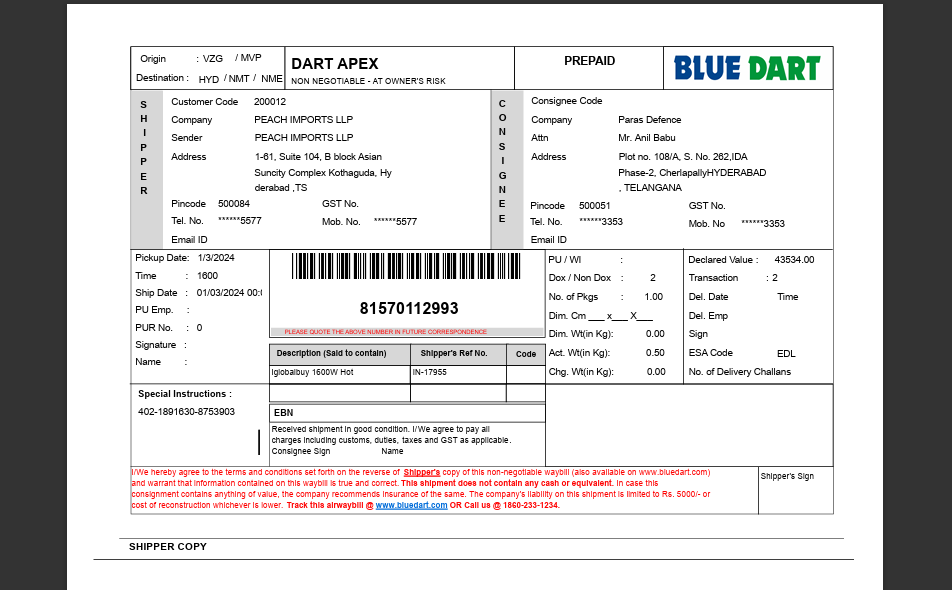

This is Air Waybill.  

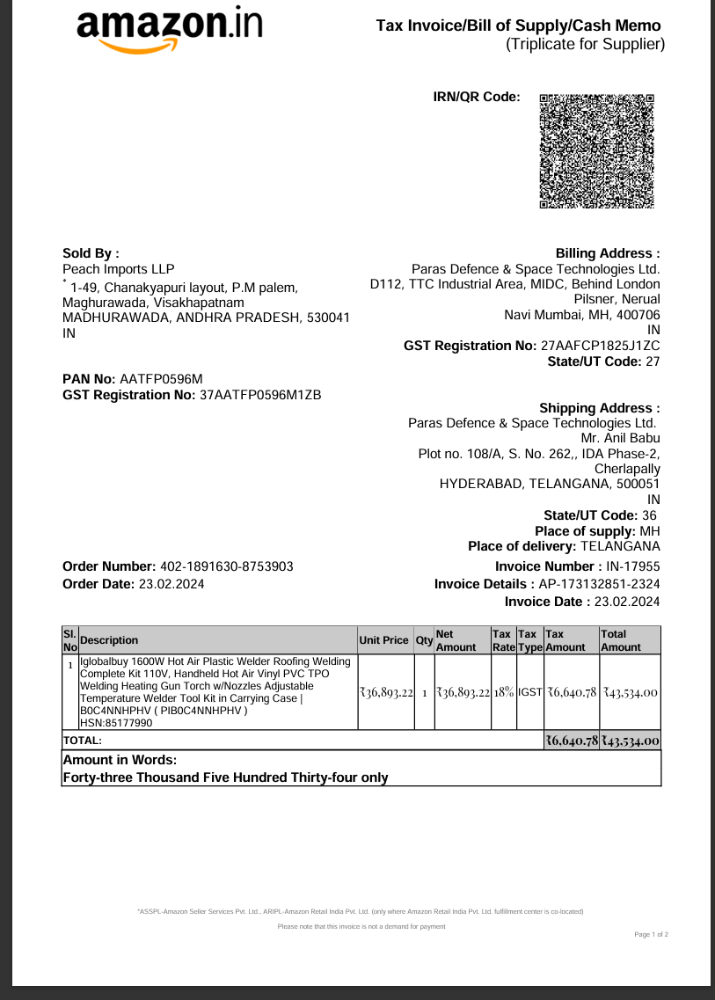   

This is Invoice bill.

* **Step12:** Now click on “done” to do outbound. And the product will deliver to customer.

## View Backend  
> [!NOTE]
>  We are not using this View Backend, to upload the files in backend we are using in “VIEW DASHBOARD” and in that you can see “Upload Backend Files” as show in below image.

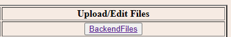

Here we are uploading directly.  

### WHY THIS BACKEND TEMPLATE:
We must print the air waybill and invoice bill after product verification.
To print those bills here, we must upload the files in backend.  

### HOW IT WORKS:
Afte uploading the merge file the pdf will moves to shipment order details page, there when we click on invoice and airway bill then the bills will visible.
### HOW TO USE: 
* **Step1:** Open Warehouse and click on side menu, move to Shipments, and click on it, there you can see two options one is View Dashboard; another one is View Backend.
* **Step2:** Click on “View Dashboard” now you see the shipment verification dashboard.

* **Step3:** Click on “Request New Link” it shows you “Shipment Verification Link Request form” template. 
* **Step4:** Click on “Backend Files” then you can see Backend Data Files Management Page.
  
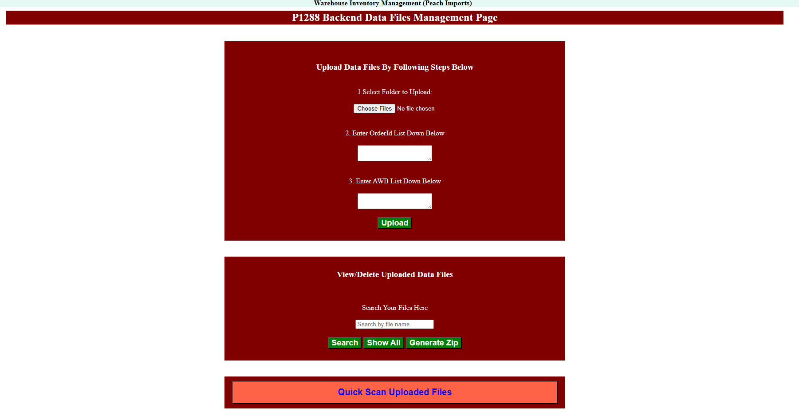

* **Step5:** Click on choose file and upload the bulk merge file.

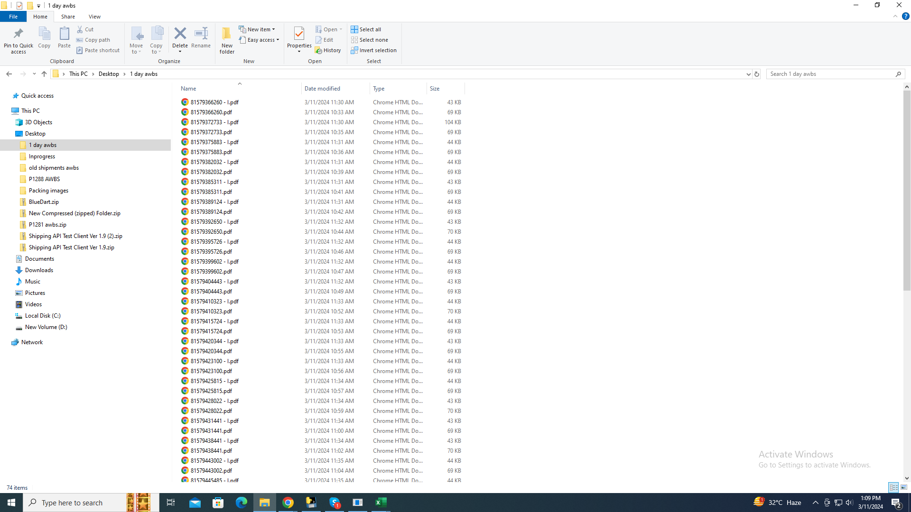

In this image we can see both air waybill and invoice bill are merged into one pdf.
* **Step6:** Give all the order id in second input filed.
* **Step7:** Give all the tracking id in third input filed and click upload.
* **Step8:** Now successfully file got uploaded and all the bills will be available to take print.
* **Step9:** In second division you can see the search your files here, this field helps you to find the file was uploaded or not.

#
# REFUNDS

### WHY THIS TOOL:

Refunds is use to display all the refund products data and also to modify the product availability state.

### HOW TO USE THIS TOOL:

* **Step-1:-**  Open WIM click on Returns  in Menu and in that click on sub menu called manage returns.
 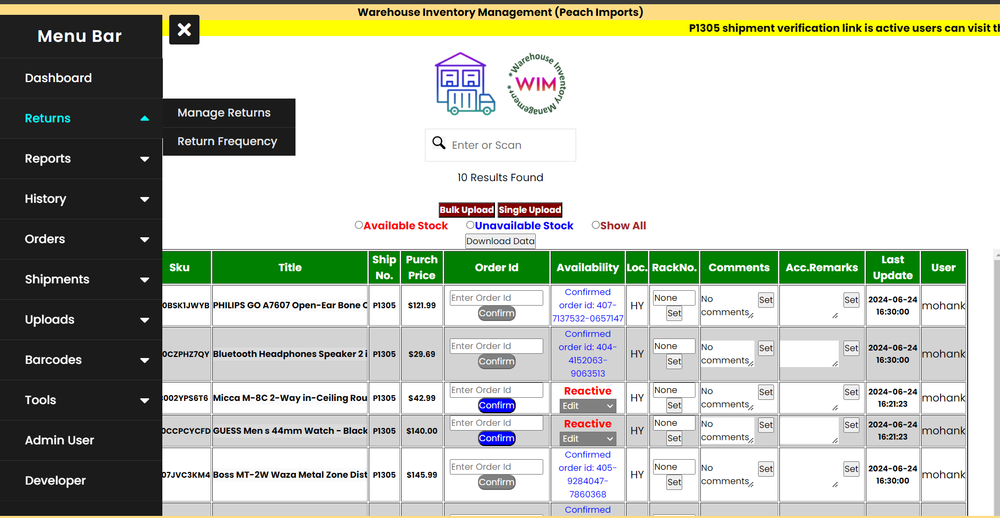

* **Step-2:-** Now you can see the page with search bar and filter. In that select the refund and enter search button, it shows all the data related to refund products
 
 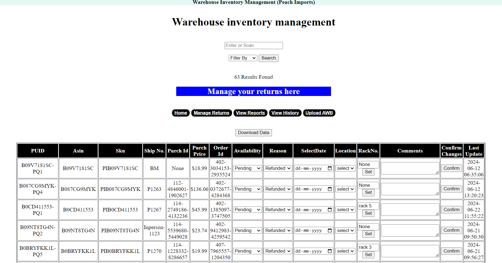

* **Step-3:-**  Once the product got refund to the customer immediately in mail, they get the notification message in that you can see the data related to that product
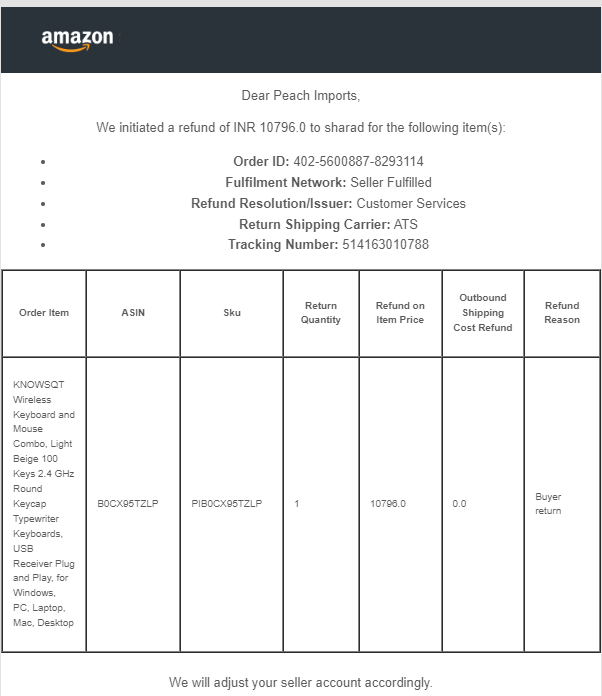

* **Step-4:-**  Now, after the product received to the offline store then based on the product condition they will change the status.
Status like(Restock, Add to bin, Inactive, Fake, Proactive, Lost )
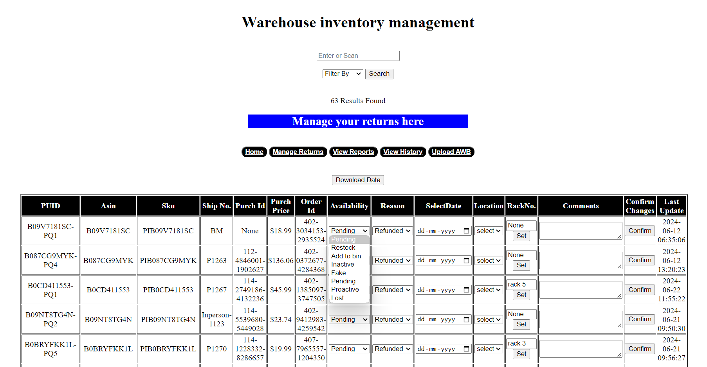

* **Step-5:-** once the product got updated the status then that product will not be in refund table.

#

# 7.UPLOADS  
Uploads field is used to upload the shipment data. In that field contains Manual(single), New Data (Bulk) and Edit old (Bulk).  

### WHY THIS TOOL:  
Uploads field is used to upload the shipment data. In that field contains Manual(single), New Data (Bulk) and Edit old (Bulk).  

### HOW TO USE THIS TOOL:  

**Manual(single):**   
* **Step-1:-** In this field, we need to fill the form to enter a single product.
  
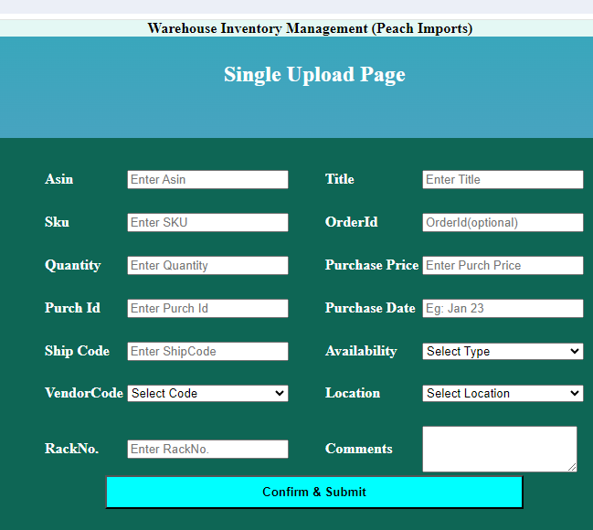

#

## 8.BARCODES  
BARCODES field is used to print the barcodes using PUID. To label the products.  
### WHY THIS TOOL:  
This tool is helpful for **FULFILLMENT** Department to distinguish the products using these barcodes and easy to Restock the products.

### HOW TO USE THIS TOOL:  
* **Step-1:-** Open WIM and click on Barcodes field in menu and select Generate Barcodes.
  
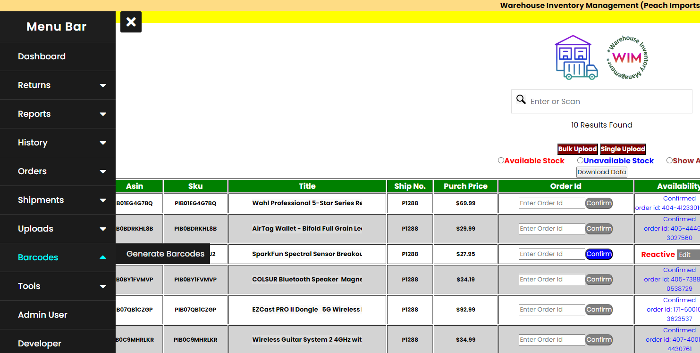
  
* **Step-2:-** Enter PUIDs that you want to generate barcodes.
  
* **Step-3:-** Generate the barcodes using Generate Barcodes button.
  
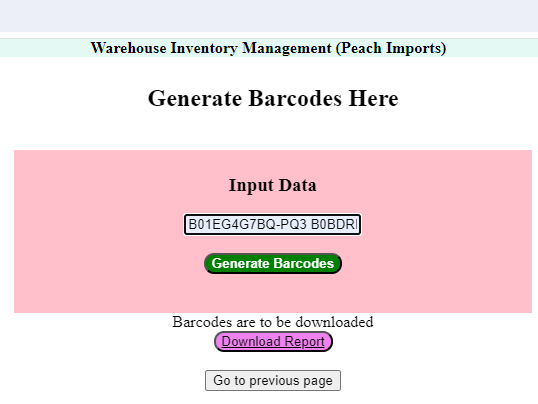
  
* **Step-4:-** Download the barcodes Using Download Reports Button.
  
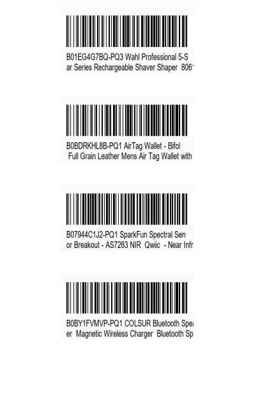
  
* **Step-5:-** They will stick these barcodes to the products.
  
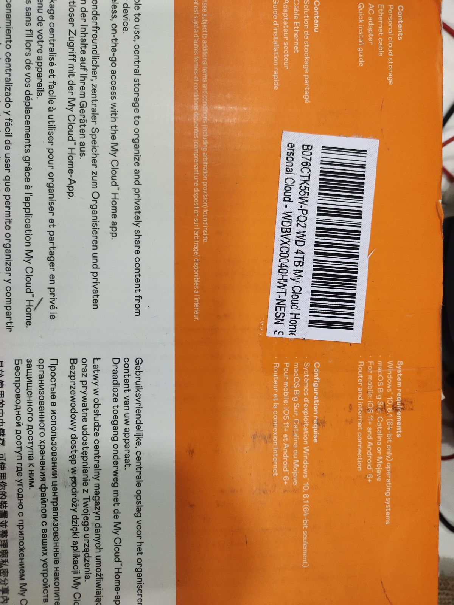

#

