# Tools-Docs
Informational guides for users about all the existing tools

# AUTOMATION TOOLS

1.	SHIPMENT TRACKING - (offline)
2.	BUY BOX - (online & offline)
3.	KEY WORD -  (offline)
4.	SIMPLE DOT COM - (online)
5.	PRICE UPDATION - (online)
6.	PRODUCT IMAGE - (offline)
7.	IMAGE DOCX - (online)
8.	NEW INVENTORY LIST - (online)
9.	BULK MERGING - (online)
10.	NEW ORDERS TRACKING - (offline)
11.	BULK PDF READER - (online)
12.	REFUND PROGRAM - (offline)

# WIM (WAREHOUSE INVENTORY MANAGEMENT )

1.	SHIPMENT VERIFICATION
2.	ASIN AVAILABILITY 
3.	INVENTORY STOCK REPORT
4.	SHIPMENT REPORT
5.	PUID BARCODE
6.	RETURNS
7.	REFUNDS 
8.	UPDATION HISTORY 

#
# USER GUIDE TO USE KEYWORD TOOL
### 1.	Why this tool:

* 	Before this tool the listing process becomes very tough and takes more time to do the work.

* 	So, to overcome this problem we use this KEYWORD tool and it reduced the time complexity and also the listing quantity increased.

### 2.	How it work : 

* 	This tool is used to get all the ASINS of particular product ( ex: IPHONE ).
* 	And after fetching all the ASINS  the listing work will becomes  simplified. 

### 3.	How to use it : 
 
* **Step1 :**   Open KEYWORD program and run the program
* **Step2 :**  Now after code runs we have to give USERNAME, PASSWORD, PRODUCT SEARCH TITLE
  
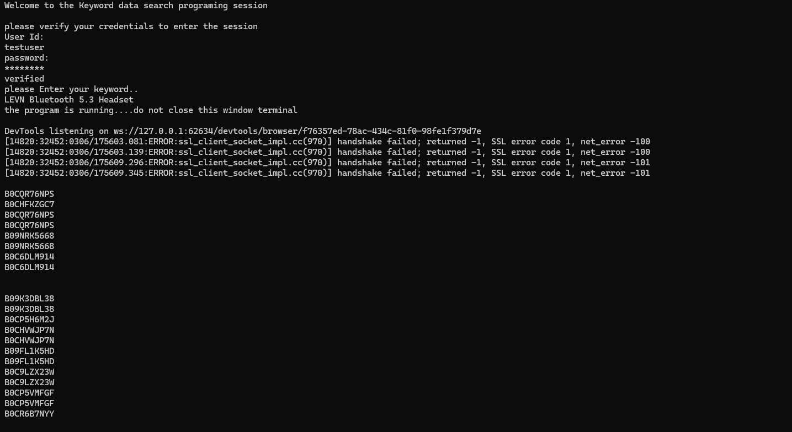
  
* **Step3 :**  And now the program provide all the ASINS in terminal that indicates completion  of the program.
  
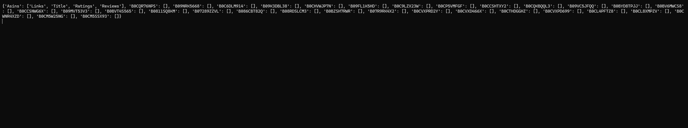  

* **Step4 :** Now this ASINS will display into EXCELL SHEET, where the sheet present in same code file and now by using this tools the listing process will become easy and simplified
  
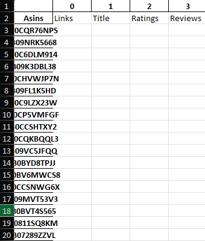

* **Step5 :** Now operation team manually check these ASINS in amazon seller central and if the product has  less number of sellers and high rating then they will add this particular ASIN to listing.
  
### 4.	Any updates required
*	By using this tool we are fetching only ASINS, but they requirement is to fetch the product TITLES  along with the ASINS.
  
# 

# USER GUIDE TO USE SIMPLE DOT COM TOOL
### 1.Why this Tool:  

This Simple Dot Com tool is used to upload the products in bulk, this tool makes operations department’s work easy by providing all the related fields which are required to upload the products in amazon seller central.
Before this tool, they used to enter data manually.

### 2.How it works:  

It takes bulk ASINS as input and provides all related data.

### 3.How to use it:  

* **Step-1:-** Open Simple Dot Com and paste the listing data ASINS which we want to bulk upload in amazon.in and click submit button.
  
  

* **Step-2:-** Simple Dot Com program  automatically produces the output excel sheet which contains ASINS and their related fields including PRICE converted to Indian currency that used to upload the data in Amazon seller central.
  
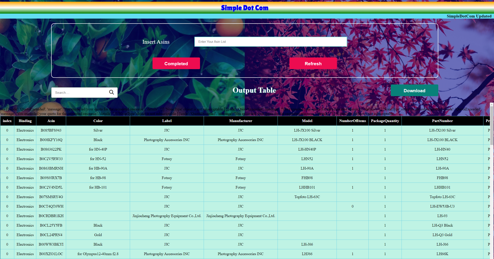  

* **Step-3:-** Now, download this sheet and Copy only required fields like ASIN , SKU , TITLE , BRAND NAME ,PRICE and WEIGHT data.
  
* **Step-4:-** And paste these 6 fields in Bulk formula sheet and the formula  will produce SALE PRICE and MRP which are also important to upload products using FLAT file.
  
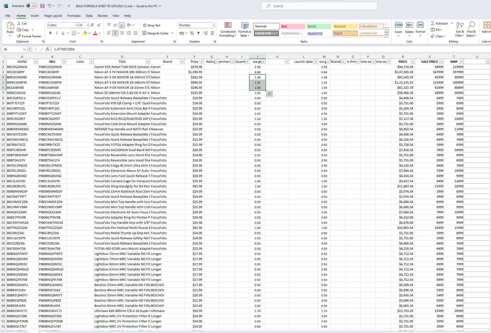  

* **Step-5:-** Open Amazon’s FLAT file provided by Amazon and Paste the data. And save the file with txt (tab delimiter) extension.
  
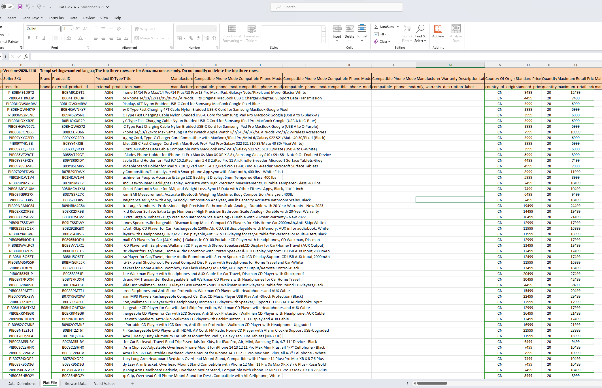  

* **Step-6:-** Now, Open amazon seller central and upload this FLAT file and click submit products.
  
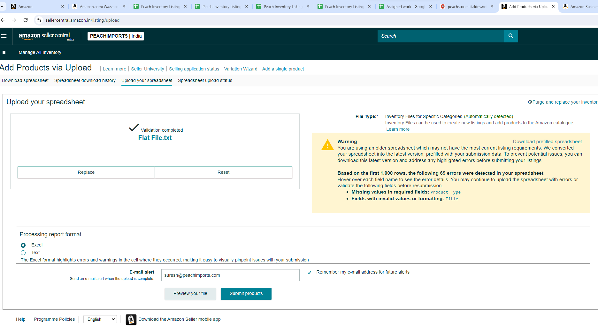  

* **Step-7:-** Then Amazon itself automatically uploads this bulk data in Amazon.in.
  
* **Step-8:-** Now, this data is visible to our amazon customers and shows seller as Peach imports.
  
### 4.Any Updates (If required): 

#

# USER GUIDE TO USE NEW INVENTORY LISTING

### 1.	Why this tool:
When operation team is done with their listing work we have to update the new list data, through that data we can check each members performance and can also update weight of the product, if the weight doesn’t match after stock delivered.
This tool is used for daily work updates for operation team.

### 2.	How it works: 
When we submit the bulk upload ASINS in this tool, it provides with some filed like (index, ASIN, date, restricted, name, weight, comment)
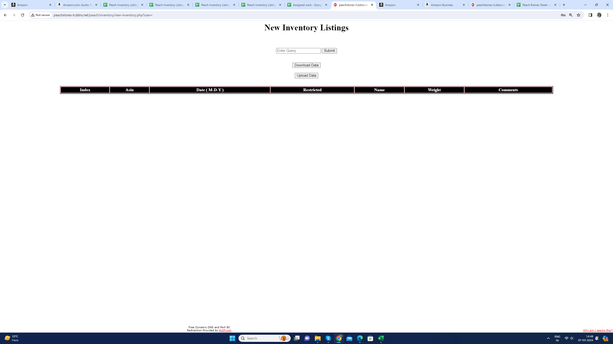 

### 3. How to use it:

*	**Step1:**  Upload the bulk upload ASINS in the query field.
*	**Step 2:** It provides all the details of that ASINS.
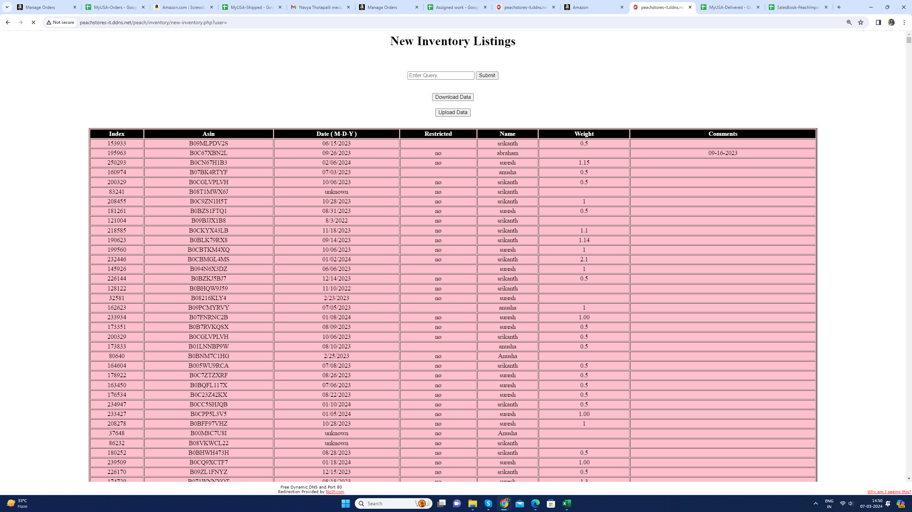  
* **Step3:** Now it shows the result table, there you can see some fields like 
Index, ASIN, date, restricted, name, weight, comment), now according to that fields we can check the product index, weight, ASIN, date of upload in the tool and also, we can check the person Name who was uploaded the data.
Setp4: And there is one more field called RESTRICTED here the operation team will directly mention “no".

> [!NOTE]
> Here if there is any product got restricted, then operation team will update restricted field to “YES”

* **Step 5:** We can also check each product result table data by uploading single ASIN of each product.
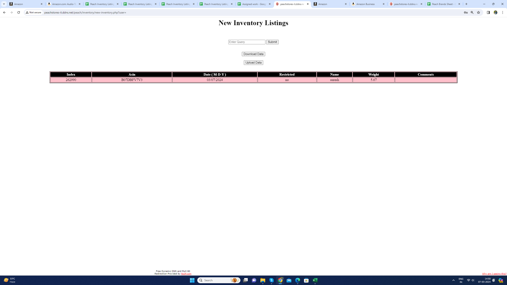  
* **Step 6:**  So, Now we can track the each person performance in operation team and also we can do update like (weight changing, updating restricted field).
### 3.	Any updates required: 	
#
# USER GUIDE TO USE AUTO PRICING CALCULATOR TOOL  
### 1.Why this tool:  

This **AUTO PRICING CALCULATOR** tool is used to update the product price automatically in amazon.in whenever there any change in price in amazon.com.
Before this tool they used to update the prices manually which will take days to complete the work. But this tool completes the work in minutes.  

### 2.How it works:  

This auto pricing calculator takes ASINS as input and produces the fields like SP, MRP, MIN price and MAX price. Which are used in auto pricing to achieve **BUY BOX**.  

### 3.How to use it:  

**Step-1:-** Open Auto pricing calculator contains tool and paste the ASINS in insert your queries field if you have more than one ASIN.  

  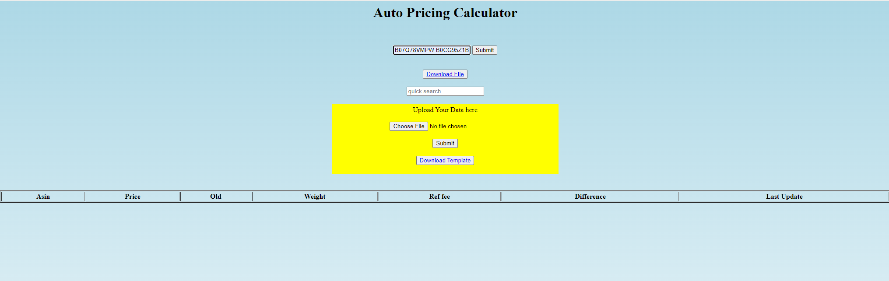  
  
**Step-2:-** Click submit button, this will generate the downloadable file link and download the file using the download file button.  

**Step-3:-** Now, open the downloaded excel sheet and it will display the updated pricing data.  

  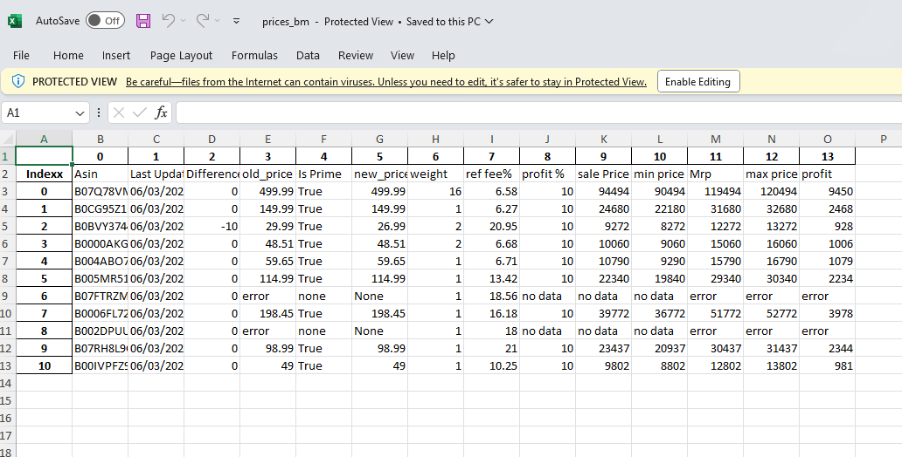  
  
**Step-4:-** Otherwise, use quick search field to enter single ASIN.  

**Step-5:-** This quick search will directly display the updated pricing data in the current page without any external file.  

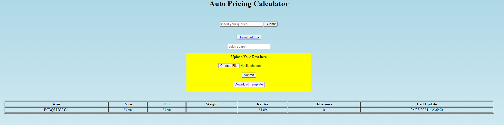  

### 4.Any Updates (If required):  

#

# USER GUIDE TO USE BUY BOX API 
### 1.AMAZON Buy Box eligibility factors:  

Sellers can’t just sign up and become eligible to appear on the Buy Box. Amazon considers a variety of factors before approval, although the first four factors listed below.
  *	Fulfilment method.
  * Landed price.
  * Shipping time.
  * Feedback rating.
  * Seller metrics.
    
are the most influential. 
### 2.Why this tool:  

Buy Box tool is used to help us to display our products in higher priority when customer search for some products in our listing and also shows our company name in seller and sold by.
Before this tool, they manually updated the prices to get Buy Box and It takes weeks to complete the work but now, the work became easy and time saving and now, they can do more work in less time.

### 3.How it works:  

The Buy Box API will take no. of ASINS and produces the table of products data. Now download the data using download button. Now open this downloaded file in Excell sheet and apply the filter to get only Buy Box FALSE data. So that we can update pricing rule to this FALSE data to achieve **BUY BOX**. 

### 4.How to use:  

* **Step-1:-**  Firstly, open Buy Box API and  paste the ASINS data in the input field and click submit button.
  
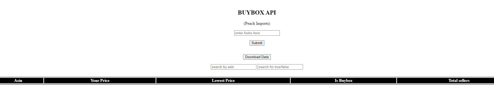  

* **Step-2:-**  It will produce the list of products , we need to download the file using download file button.
  
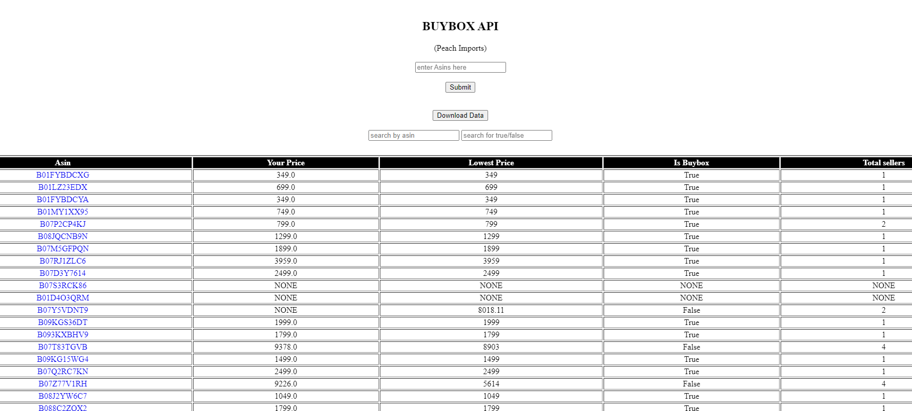  

* **STEP-3:-** Search for the Buy Box FALSE products in search field and copy the particular ASIN.
  
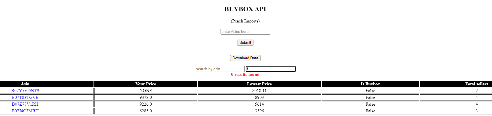  

* **Step-4:-**  Now , open Amazon Seller central and paste the ASIN and reduce the price , apply coupons , update handling time or Automate the pricing to achieve  Buy Box.

  
> [!NOTE]
>We should be careful while entering Min and Max prices otherwise it will return **FIXED PRICE ERROR**.

  
### 5.Any Updates (If required):  

1.	Some products are displaying FALSE in Is Buy Box field even though the products are already in Buy Box (TRUE).
#

# USER GUIDE TO USE PRODUCT IMAGE TOOL
### 1.	Why this tool:
*	For doing technical write up and catalogue.
*	We should provide the CUSTOMS SHEET to CUSTOMS DEPARTMENT.
*	So, in that sheet we must provide the shipment details like (IMAGE, TITLE, END USER, CATAGORIES).
*	In this sheet except IMAGE remaining, they will fill the data by manually.
*	So, by filling manually they take more time, and they can’t reach their targets.
*	To overcome all this issues PRODUCT IMAGE TOOL, play major role.

### 2.	How it works:
The main task of this tool is to provide the image URLs. 

### 3.	How to use it:
* **Step 1:** First operation team will get all the bulk shipment ASINS in on excel sheet.
* **Step2:** Now operation team will upload this ASINS in “asins_list” text file.
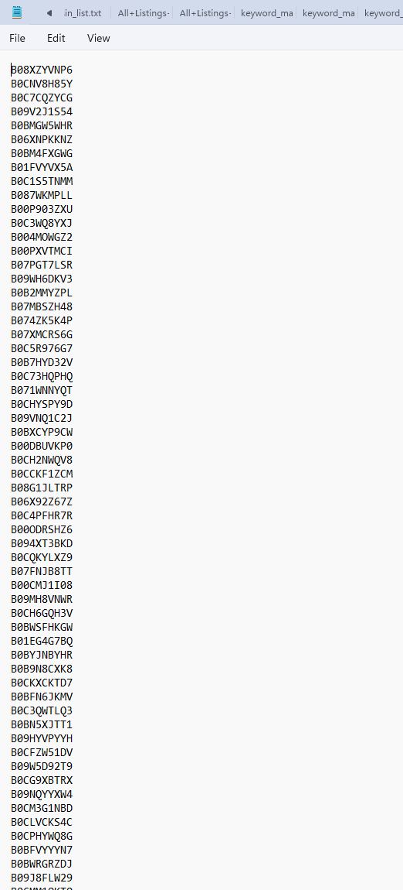

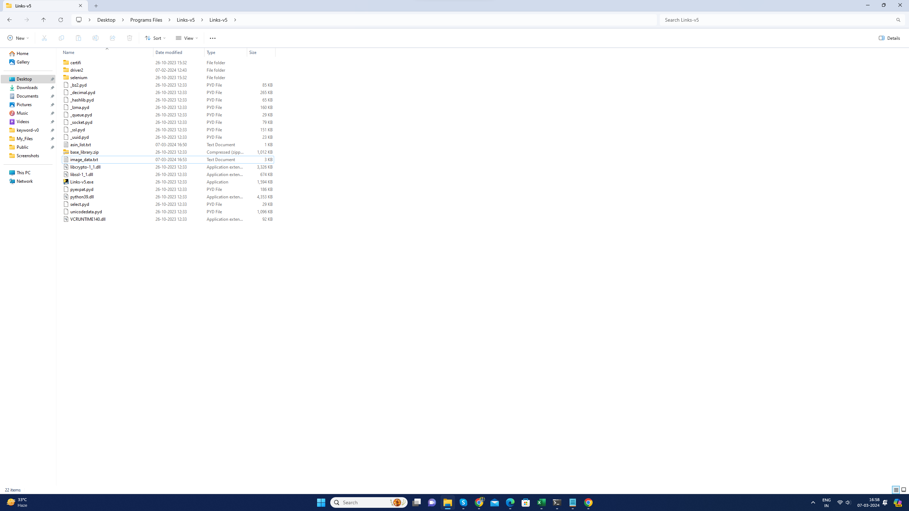  

**The above image represents the program file where you can find the .exe file which is use to run the program, and “asins_list” and “image_data” text file are also available in the same folder.**  

* **Step 3:** Now after running the program, it will provide all the image URLs automatically by checking the ASINS in “asins_list”.
  
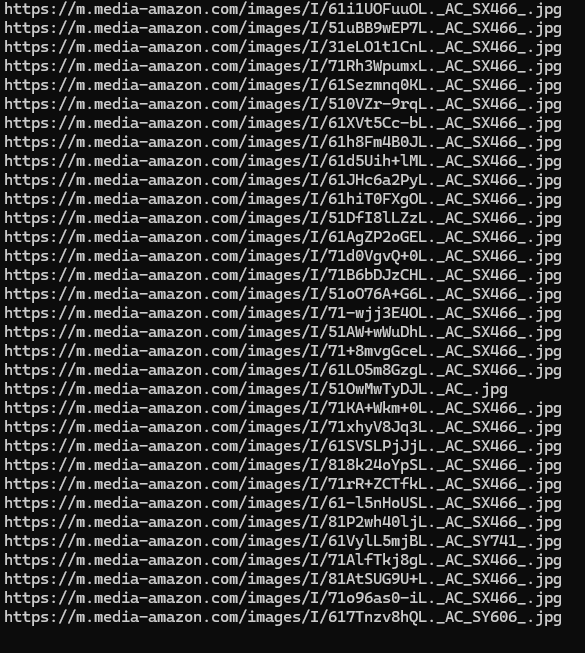  

**In the above image you can see the output of bulk ASINS.**

* **Step4:** Now after program completed all the URLs will be displayed in “image_data” text file.
  
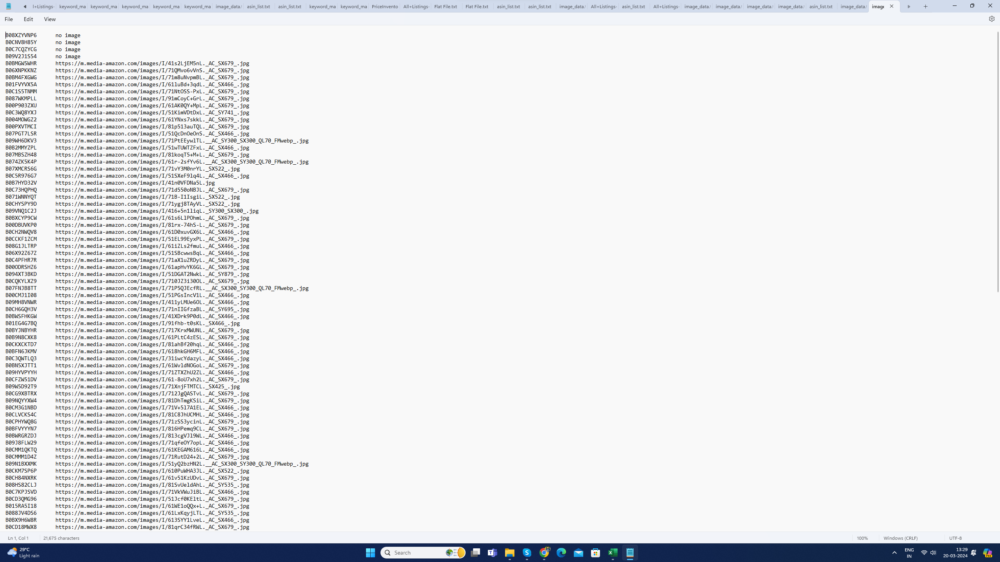  

**In the above image you can see the output of Shipment Product image links.**  

**Step 4:** And this “image_data” text file is used in IMAGE DOCX TOOL to convert the URLs to images.

### 4.	Any updates required:

#
# USER GUIDE TO USE IMAGE DOCX TOOL  

### 1.Why this tool:  
This tool is used to convert bulk image URLs to images and place these images in a Docx file which is catalogue file used for Customs verification.
Before this tool they used to insert each image manually in catalogue docx file which takes weeks to complete the work but now with the help of **PRODUCT IMAGE** and **IMAGE DOCX Tools**, the work became easy.

### 2.How it works:  
This IMAGE DOCX tool takes output of **Product Images** that is ASINs and their image URLs as input and produces images placed in catalogue form.
This tool takes bulk data and produces the results in catalogue form which is a format used for Customs verification.  

### 3.How to use it:  

* **Step-1:-** Copy the output of PRODUCT IMAGE tool that is ASINS and image URLs.
  
* **Step-2:-** Now, open IMAGE DOCX and paste the ASINS and image URLs in the input field.
  
  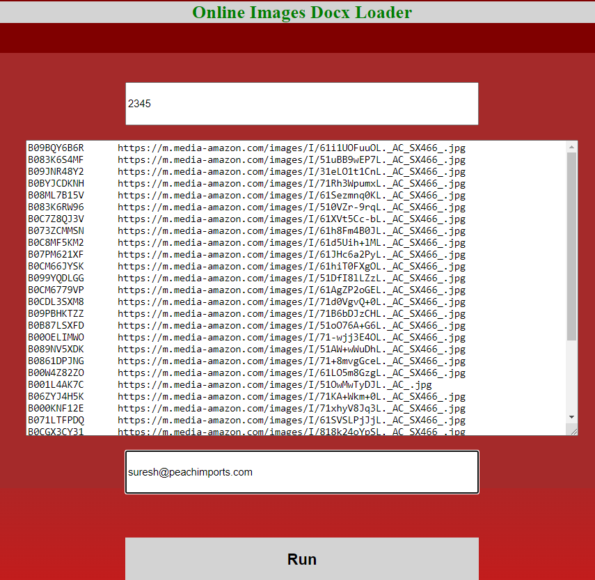  
  
* **Step-3:-** Click Run button and then Click download file button.
  
  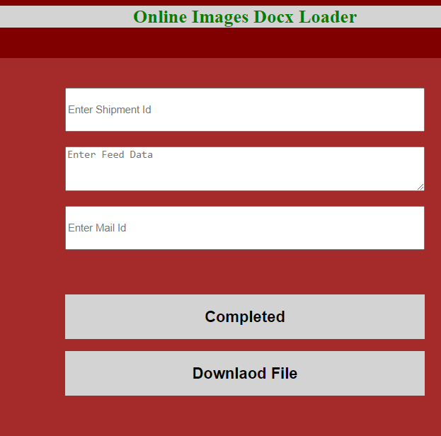
  
* **Step-4:-** Now, all the IMAGES and ASINS are placed in the catalogue form(Customs format) in Docx.
  
  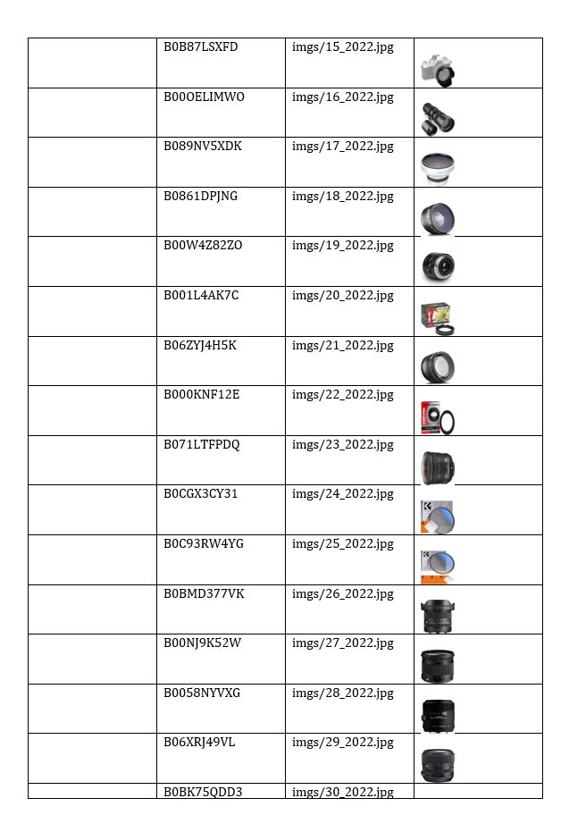
  
* **Step-5:-** Then, they have to fill the remaining fields like end user , category Etc and submit the form to the customs Department.

### 4.Any Updates (If required):  

#

# SHIPMENT VERIFICATION TOOL  

### 1.Why this tool:  
This tool is used to verify the shipment products. Whenever we receive the shipment, we need to verify the products using shipment Verification tool.
### 2.How it works:

  
### 3.How to use it:  

* **Step-1:-** When we receive the shipment, Open the shipment verification tool.
* **Step-2:-** Enter the details like shipment id,
* **Step-3:-** Now, take any product from the shipment and check for that particular product name in the shipment verification list.
* **Step-4:-** If you find the product in the shipment list then bubble the product in verification filed. And If you find the same product in the shipment list then bubble the product again.
* **Step-5:-** Which means, the number of bubbles in each product indicates the quantity of particular product.
* **Step-6:-** After finishing shipment products verification. Click on orders filed and if any orders are there for that particular product, then print the invoice and airway bill and pack the product.
* **Step-7:-** Otherwise, place the product in PRO ACTIVE.

### 4.Any Updates (If required):  

#  

# USER GUID TO WAREHOUSE INVENTORY MANAGEMENT (WIM)

**MENU:**
### 1.	DASHBOARD

### 2.	RETURNS
   * 	MANAGE RETURNS
   *	RETURN FREQUENCY
### 3.	REPORTS
   *	STOCK REPORTS
   *	SHIP WISE REPORTS
   *	DATE WISE REPORTS
   *	DATE REPORT (NEW)
### 4.	HISTORY
   *	VIEW HISTORY
   *	VIEW FILES
### 5.	ORDERS
   *	BULK CONFIRM
### 6.	SHIPMENTS
   *	VIEW DASHBOARD
   *	VIEW BACKEND
### 7.	UPLOADS
   *	MANUAL (SINGLE)
   *	NEW DATA (BULK)
   *	EDIT OLD (BULK)
### 8.	BARCODES
   *	GENERATE BARCODES
### 9.	TOOLS
   *	VIEW DASHBOARD
   *	ONLINE IMAGE DOCX
### 10.	 ADMIN USER

### 11.	 DEVELOPER

# 1.DASHBOARD:

**WHY THIS TEMPLATE:**
This template is helpful for FULFILMENT DEPARTMENT. They will upload the bulk file here itself, later in dashboard you can see all the shipment details.
HOW IT WORKS:
1. In dashboard we can see Bulk Upload and Single Upload buttons, upcoming shipment data, and we can also download the Available stock data, Unavailable Stock data, Complete data.

## REPORTS
Reports field is used to maintain the stock reports. This Reports field will show all the products in monthly wise reports, Stock reports, shipment wise reports.  
### 1.WHY THIS TOOL:  
The Reports field is helpful for **WAREHOUSE** Department to maintain and manage the WAREHOUSE Stock. By using this tool, they will  update the stock details like PROACTIVE and REACTIVE to SIR.  

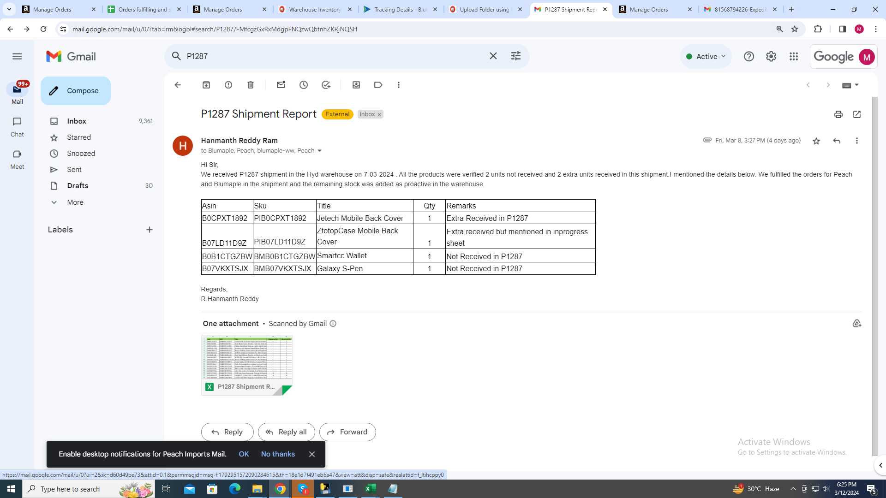  

### 2.HOW TO USE THIS TOOL:  

**STOCK REPORTS:**
* **Step-1:-** Open WIM and click on Reports field in menu and select Stock Reports.

 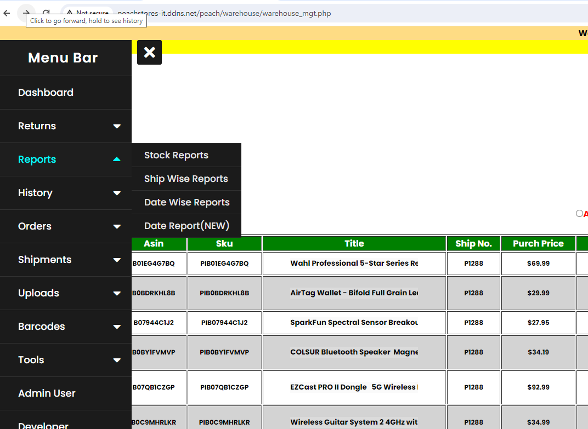  

* **Step-2:-** Show all button will produces all the data about the products which are in our WAREHOUSE (PROACTIVE).

  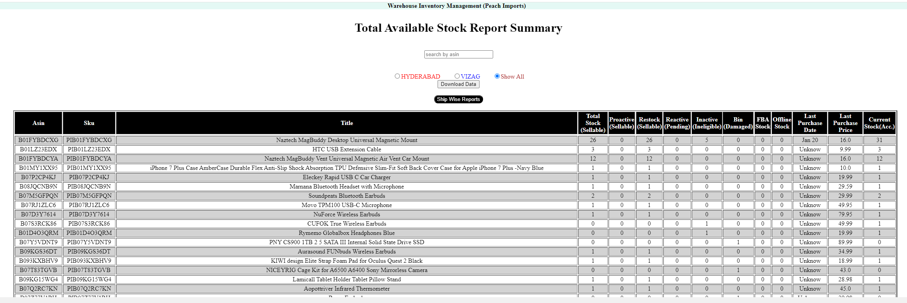
  
* **Step-3:-** Vizag button will produces products data which are in Vizag and Hyderabad button will produces products data which are in Hyderabad.

* **Step-4:-** We can download this data using download data button.

**SHIP WISE REPORTS:**  
* **Step-1:-** Select the Ship code then it will produces the Shipment Wise Records.

* **Step-2:-** The Dynamic Stock table represents the overall stock that is PROACTIVE and REACTIVE in that particular Shipment.
  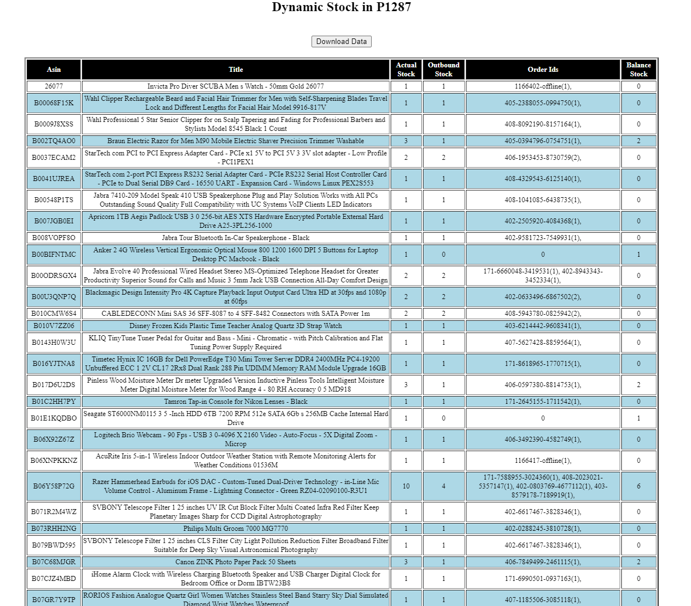

* **Step-3:-** The Unused Stock table represents the PROACTIVE Stock that is the left over stock after outbound in that particular Shipment.
  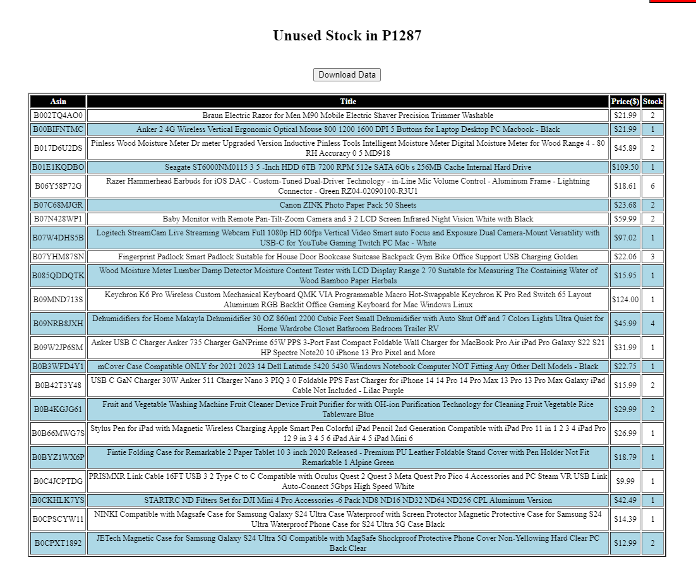

* **Step-4:-** The middle table represents all the shipment data with PUIDs. The PUIDs are used to distinguish the products with Same ASIN, So that it is easy for FULFILMENT Department to know which product got returned.
  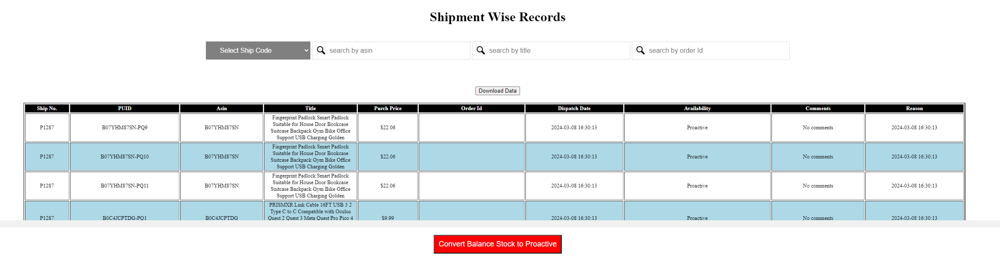

* **Step-5:-** The Shipment products are REACTIVE by Default and They use convert the balance stock to Proactive button to Convert the remaining products after outbound to Proactive.

**DATE WISE REPORTS:**  

* **Step-1:-** Enter the start date and the end date and click submit button.

* **Step-2:-** It will produces the date wise reports.
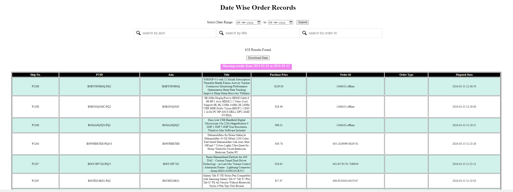

**DATE REPORTS:**  
* **Step-1:-** Enter the start date and the end date and click submit button.

## HISTORY  
History is used to know what the updates or actions are done in the WIM at what time and how has done that action.  

### 1.WHY THIS TOOL:  
This tool is helpful for FULFILMENT Department to know daily updates and history.  

### 2.HOW TO USE THIS TOOL:  
* **Step-1:-** Open WIM click on History in Menu and it will produces all the log data.
  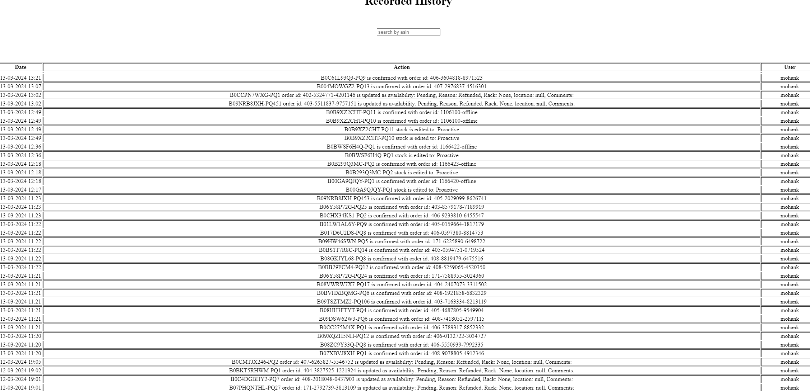

* **Step-2:-**

## UPLOADS  
Uploads field is used to upload the shipment data. In that field contains Manual(single), New Data (Bulk) and Edit old (Bulk).  

### 1.WHY THIS TOOL:  
Uploads field is used to upload the shipment data. In that field contains Manual(single), New Data (Bulk) and Edit old (Bulk).  

### 2.HOW TO USE THIS TOOL:  

**Manual(single):**   
* **Step-1:-** In this field, we need to fill the form to enter a single product.
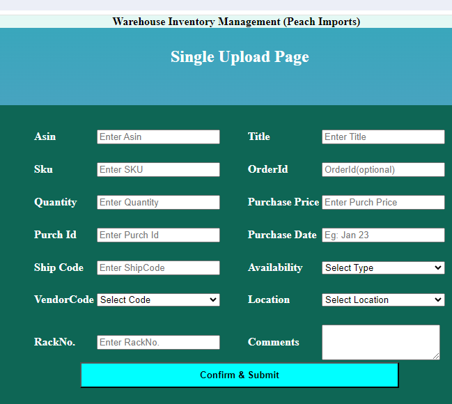

## BARCODES  
BARCODES field is used to print the barcodes using PUID. To label the products.  
### 1.WHY THIS TOOL:  
This tool is helpful for **FULFILLMENT** Department to distinguish the products using these barcodes and easy to Restock the products.

### 2.HOW TO USE THIS TOOL:  
* **Step-1:-** Open WIM and click on Barcodes field in menu and select Generate Barcodes.
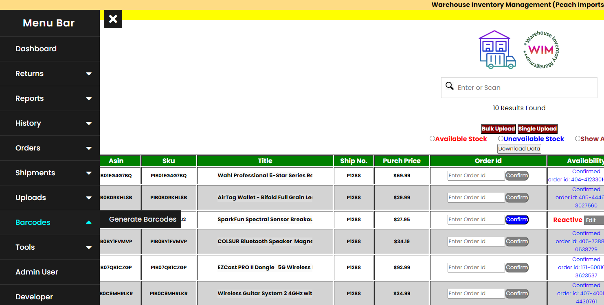
  
* **Step-2:-** Enter PUIDs that you want to generate barcodes.
  
* **Step-3:-** Generate the barcodes using Generate Barcodes button.
  
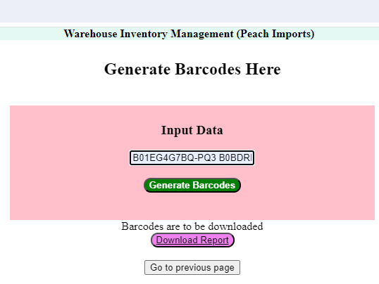
  
* **Step-4:-** Download the barcodes Using Download Reports Button.
  
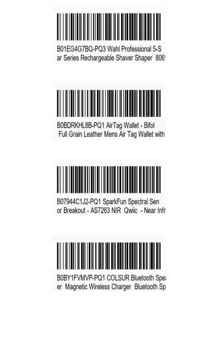
  
* **Step-5:-** They will stick these barcodes to the products.
  
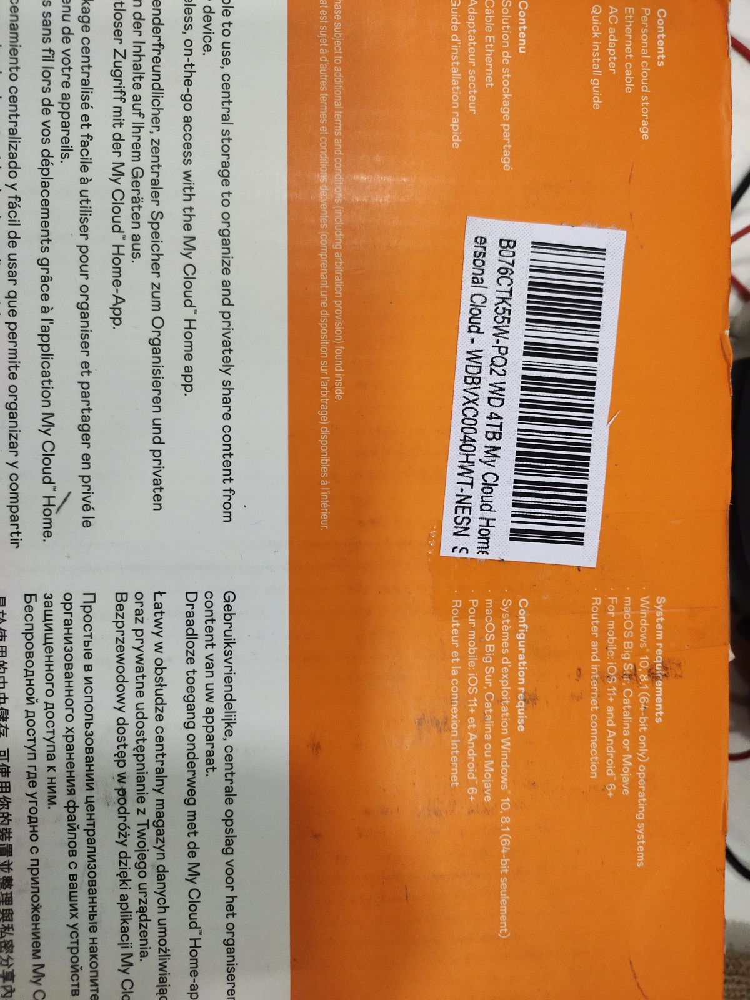

#

